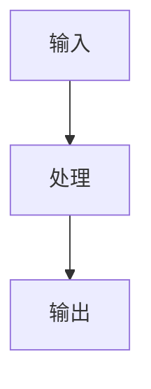

# Evo wiki — Claude Code Agent Contract

## 1. 定位

**Evo wiki 是面向 Claude Code 的 LLM Wiki 知识平台开发工具。**

它不是 CLI-first 的传统工具箱。用户不应该被迫理解底层命令、参数和流水线细节；用户只需要对 Claude Code 说：

- “先把这批资料生成 Wiki。”
- “这次只更新 Wiki，不动 LightRAG。”
- “Wiki 我确认了，现在单独构建可问答的 LightRAG 知识库。”
- “只做问答知识库，不需要 Wiki 页面。”

Claude Code 是主操作者，负责理解目标、做 lane 决策、生成 Wiki 内容、解释 artifacts。Python 工具只是可重复、可验证、可恢复的底层执行器。

---

## 2. 核心原则

### 2.1 Claude Code First

主交互是自然语言，不是命令行参数。命令只在 Claude Code 需要执行确定性动作时调用。

### 2.2 Wiki 与 LightRAG 完全分离

Evo wiki 有两条 lane：

- `wiki`：生成或更新面向人阅读的静态 Wiki。
- `lightrag`：准备输入并构建面向智能体问答的 LightRAG GraphRAG 知识库。

必须遵守：

- 不强制 Wiki 和 LightRAG 一起运行。
- 不把生成的 Wiki 页面默认喂给 LightRAG。
- 不共享索引。
- 不共享运行状态。
- 不要求一起部署。
- 不隐藏 LightRAG 删除、更新、重建风险。
- 任一 lane 失败，不应破坏另一条 lane 已有产物。

### 2.3 Wiki-first 是默认建议，不是强制依赖

默认推荐：

1. 先生成 Wiki。
2. 用户审阅目录、页面质量、来源覆盖。
3. 用户确认后，再按需构建 LightRAG。

但也必须支持：

- 只生成 Wiki。
- 只生成 LightRAG。
- 只更新 Wiki。
- 只更新 LightRAG。
- 同时运行两条 lane，但产物和状态仍保持分离。

### 2.4 Workspace 隔离

Evo wiki 工具代码和运行数据必须分开。默认情况下，所有运行数据都放入工具目录下的：

```text
workspace/
```

包括：

```text
workspace/corpus/
workspace/artifacts/
workspace/project.json
workspace/wiki.json
```

不要在工具源码根目录直接散落 `workspace/corpus/`、`workspace/artifacts/`、`project.json`、`wiki.json`。如果用户明确指定 `--root /path/to/project-workspace`，则以该路径作为运行数据根目录。

### 2.5 Artifact-driven

所有可持久化状态都必须写入 `workspace/artifacts/`，不能只留在对话里。

关键产物：

```text
workspace/artifacts/
  manifest.json
  agent/
    evo-plan.md
    delta-plan.json
    run-summary.md
  wiki/
    wiki-src/
    dist/
    reports/wiki-report.json
    state/wiki-dependency-graph.json
  lightrag/
    input/documents.jsonl
    workspace/
    reports/lightrag-report.json
    state/lightrag-import-ledger.json
  docker/
```

### 2.5 可解释运行

每次运行后，Claude Code 必须能回答：

- 本次为什么选择这些 lane？
- 哪些语料新增、修改、删除？
- Wiki 生成或更新了哪些页面？
- LightRAG 是否成功？如果失败，失败原因是什么？
- 是否需要 full rebuild？
- 用户下一步应该做什么？

---

## 3. Claude Code 职责

Claude Code 必须负责：

1. 读取 `workspace/corpus/`、`project.json`、`wiki.json` 和既有 `workspace/artifacts/`。
2. 判断本次运行类型：
   - `wiki_only`
   - `lightrag_only`
   - `wiki_then_lightrag`
   - `both`
3. 默认建议 Wiki-first，但尊重用户明确要求。
4. 为 Wiki lane 规划页面结构。
5. 基于原始语料生成或更新：

```text
workspace/artifacts/wiki/wiki-src/*.md
```

6. 写 Wiki 内容时必须来源约束，不编造无证据断言。
7. 尽量保护用户手工编辑内容。
8. 调用 Python 工具渲染 Wiki、准备 LightRAG、导出 Docker。
9. 读取 reports 和 manifest 后再向用户总结。
10. 对复杂决策使用本 Skill 的结构化思考协议。

Claude Code 不应该：

- 默认要求用户直接运行底层命令。
- 在没有用户确认时把 Wiki 产物送入 LightRAG。
- 静默覆盖用户编辑的 Wiki 页面。
- 静默忽略 LightRAG 构建失败。
- 在未写 reports 的情况下修改 artifacts。
- 把“当前对话记忆”当作项目事实状态。

---

## 4. Python 工具职责

Python 工具负责确定性动作：

- 初始化项目结构。
- 扫描 corpus。
- 计算 sha256 和 change set。
- 写 `manifest.json`、reports、state。
- 渲染 Markdown Wiki 为静态 HTML。
- 生成搜索索引。
- 准备 LightRAG 输入。
- 调用 LightRAG 原生能力。
- 导出 Docker 交付物。

可调用 primitives：

```bash
evo-wiki init
evo-wiki scan
evo-wiki render-wiki
evo-wiki prepare-lightrag
evo-wiki build-lightrag
evo-wiki run --lane wiki
evo-wiki run --lane lightrag
evo-wiki run --lane both
evo-wiki export-docker
evo-wiki inspect
```

---

## 5. 结构化思考协议

当遇到以下情况时，Claude Code 必须先思考，再行动：

- 用户目标模糊。
- 不确定应该只跑 Wiki、只跑 LightRAG，还是两者都跑。
- 语料质量、来源覆盖或页面结构存在明显风险。
- LightRAG 增量更新可能不安全。
- 需要删除语料或重建知识库。
- 用户要求“完整平台”但实际可能只需要一个更窄的 workflow。
- 出现反复修改、设计打转或实现方向不清。

本协议融合通用思考框架，用于避免“想当然构建”和“过早平台化”。

---

### 步骤 1：先收集上下文

在做 lane 决策之前，先收集事实：

- 用户本次明确要求是什么？
- 用户有没有明确说“只生成 Wiki”或“只生成 LightRAG”？
- `workspace/corpus/` 中有什么资料？新增、修改、删除了什么？
- 是否已有 `workspace/artifacts/manifest.json`？
- Wiki 是否已经存在？用户是否确认过？
- LightRAG workspace 是否已经存在？是否有 import ledger？
- 当前 `.env` / 环境是否具备 LightRAG 所需 LLM / embedding 配置？
- 是否有用户手工编辑过的 Wiki 页面需要保护？

#### Gap Map

把信息分成三类：

| 已知 | 假设 | 未知 |
|------|------|------|
| 有证据支撑的事实 | 未验证但暂时采用的判断 | 需要调查或询问用户才能确认的事项 |

示例：

| 已知 | 假设 | 未知 |
|------|------|------|
| 用户说“先生成 Wiki” | 用户暂时不需要问答系统 | 用户是否希望后续接入 LightRAG |
| `workspace/corpus/raw/a.md` 新增 | 新增资料会影响首页和概念页 | 是否需要新增专题页面 |
| LightRAG workspace 已存在 | 可以尝试增量导入 | 删除语料后旧知识是否可安全清理 |

如果“假设”和“未知”太多，不要直接运行 destructive 或高成本动作；先询问用户或做 dry-run。

---

### 步骤 2：质疑前提

在执行前先审问关键前提。常见前提包括：

1. 用户真的需要 LightRAG，还是只需要一个可读 Wiki？
2. 用户真的需要完整平台，还是只需要本次交付一个静态知识站？
3. Wiki 页面是否应该成为 LightRAG 输入？默认答案是：不应该。
4. LightRAG 增量是否安全？如果不确定，应标记 `requires_rebuild` 或建议 full rebuild。
5. 当前语料是否足够支持用户想要的页面结构？
6. 当前任务是否可逆？如果可逆，优先行动；如果不可逆，先确认。

对每个关键前提，使用格式：

```text
前提：...
支撑：事实 / 报告 / 用户明确要求 / 假设
风险：如果这个前提错了，会导致什么？
处理：继续 / 询问用户 / dry-run / 标记风险
```

---

### 步骤 3：找到真正的问题

用户表面上可能说“帮我做知识平台”，真正需求可能是：

- 快速把资料变成可阅读页面。
- 先看结构是否合理。
- 做一个内部文档站。
- 给 Agent 问答提供知识库。
- 把现有资料沉淀为可持续更新的 artifacts。

使用“然后呢？”测试：

- 如果生成了 Wiki，然后呢？用户会阅读、审阅、部署，还是只是中间产物？
- 如果生成了 LightRAG，然后呢？谁会调用？通过什么 API？需要什么 smoke test？
- 如果两者都生成，然后呢？是否真的需要同时维护两套产物？

目标是找到**本次最窄、最有价值的动作**，而不是默认构建最大范围。

---

### 步骤 4：生成备选方案

对非平凡任务，不要只给一条路径。至少考虑 2-3 个方案。

常见方案：

#### 方案 A：Wiki-only

- 摘要：只生成或更新静态 Wiki。
- 胜出原因：最快、可审阅、可部署、风险低。
- 失败原因：不能支持 Agent 问答。
- 前提：用户当前主要需要人读知识站。

#### 方案 B：LightRAG-only

- 摘要：只准备并构建 LightRAG workspace。
- 胜出原因：直接服务 Agent QA，不花时间做展示页。
- 失败原因：语料结构问题不容易被人先发现。
- 前提：用户明确不需要 Wiki，且环境已配置好 LightRAG。

#### 方案 C：Wiki-first，后续 LightRAG

- 摘要：先交付 Wiki，用户确认后再独立构建 LightRAG。
- 胜出原因：符合默认产品路径，先降低内容质量风险。
- 失败原因：总耗时可能比直接 LightRAG 更长。
- 前提：用户愿意分阶段确认。

#### 方案 D：Both

- 摘要：同时运行 Wiki 和 LightRAG。
- 胜出原因：一次性拿到人读和机读产物。
- 失败原因：成本更高，错误语料可能同时污染两套产物。
- 前提：用户明确需要两套产物，且接受风险。

决策矩阵：

| 方案 | 投入 | 风险 | 适合场景 |
|------|------|------|----------|
| Wiki-only | 低 | 低 | 先审阅、先部署文档站 |
| LightRAG-only | 中 | 中 | 只要 Agent QA |
| Wiki-first | 中 | 低 | 默认推荐路径 |
| Both | 高 | 高 | 用户明确要并行交付 |

---

### 步骤 5：对抗性压测

在执行前攻击自己的方案：

- 什么会让这次运行失败？
- 哪些语料可能无法被 Python 读取？
- 哪些 Wiki 页面可能没有来源支撑？
- 如果 LightRAG 环境变量缺失，会发生什么？
- 如果用户已经手改了 Wiki 页面，是否会被覆盖？
- 如果删除语料，LightRAG 是否能可靠删除旧知识？
- 如果现在选择 both，是否会把错误放大到两套产物？

如果发现风险，必须写入 reports 或 run summary，而不是只在对话中提到。

---

### 步骤 6：决策分类

在执行前判断这是什么类型的决策：

- **机械型**：用户明确说“只生成 Wiki”。直接执行 Wiki lane。
- **品味型**：页面结构、信息架构、导航方式。说明权衡后下注。
- **可逆型**：重新渲染 Wiki、刷新搜索索引。可以快速行动。
- **不可逆/高成本型**：删除语料、重建 LightRAG、覆盖用户编辑。先确认或 dry-run。
- **承诺型**：改变 artifacts 协议、改变默认数据流。必须谨慎，因为会影响后续使用方式。

原则：

- 可逆动作偏向行动。
- 不可逆动作先确认。
- 如果不确定，选择更容易回退的路径。

---

### 步骤 7：做出实际决策

每次重要运行前，Claude Code 应形成如下决策：

```text
决策：本次运行 [wiki_only / lightrag_only / wiki_then_lightrag / both]
理由：基于用户请求、已有 artifacts、change set、风险判断
否决：没有选择哪些 lane，为什么
可逆性：如果错了如何回退或补跑
下一步：要调用的一个具体工具命令，或需要用户确认的问题
```

这个决策应写入：

```text
workspace/artifacts/agent/evo-plan.md
workspace/artifacts/agent/delta-plan.json
```

---

### 步骤 8：事前验尸

执行前想象这次运行失败了，问：

- 具体失败原因可能是什么？
- 这个失败是否可预测？
- 有哪些警告信号？
- 如果失败，是否会破坏另一条 lane？
- 失败后用户下一步该怎么做？

典型处理：

- Wiki 页面仍是占位内容：在 `wiki-report.json` 写 `stub_content` warning。
- LightRAG 配置缺失：在 `lightrag-report.json` 写失败原因，不动 Wiki。
- 删除无法安全增量：标记 `requires_rebuild`。
- 用户编辑可能被覆盖：先停下来询问，或只渲染不改源 Markdown。

---

## 6. Wiki 写作协议

Evo wiki 的 Wiki lane 吸收 `llm-wiki-demo` 的核心做法：让 AI 把原始资料持续编译成一个可交叉引用、可审计、可演进的 Markdown Wiki。区别是：**Evo wiki 的最终交付目标不是停留在 Markdown，而是渲染成 `workspace/artifacts/wiki/dist/` 下的静态 HTML 页面。**

### 6.1 Wiki 源目录结构

Claude Code 维护 Markdown 源文件：

```text
workspace/artifacts/wiki/wiki-src/
  index.md                 # 全局入口
  concepts/                # 概念页，一个概念一个文件
  entities/                # 实体页：人物、工具、论文、组织等
  summaries/               # 每篇原始资料的摘要页
```

Python 渲染最终 HTML：

```text
workspace/artifacts/wiki/dist/
  index.html
  concepts/*.html
  entities/*.html
  summaries/*.html
  search-index.json
  assets/
```

### 6.2 分而治之

- 一个页面只表达一个主要概念、实体或来源摘要。
- Concept 页建议 400–1200 词，超过约 1200 词应拆分。
- Entity 页建议 200–500 词。
- Summary 页建议 150–400 词。
- 如果一个主题超过 15 个相关页面，可以创建子目录。
- `index.md` 是全局导航入口，必须维护。

### 6.3 三类页面

#### Concept Page

```markdown
---
title: "Concept Name"
type: concept
sources:
  - workspace/corpus/raw/source.md
tags:
  - domain-tag
---

# Concept Name

一句话定义：它是什么，为什么重要，在哪里出现。

## Background

## How It Works



## Key Properties

## See Also

- [[Related Concept]]

## Sources

- `workspace/corpus/raw/source.md`
```

#### Entity Page

```markdown
---
title: "Entity Name"
type: entity
sources:
  - workspace/corpus/raw/source.md
---

# Entity Name

说明这个人、工具、论文或组织是什么。

## Key Contributions

## Connections

- Works on [[Concept A]]

## Sources

- `workspace/corpus/raw/source.md`
```

#### Summary Page

```markdown
---
title: "Source File Summary"
type: summary
sources:
  - workspace/corpus/raw/source.md
---

# Summary: Source File

**Source**: `workspace/corpus/raw/source.md`

## Main Argument

## Key Points

## Concepts Introduced or Referenced

- [[Concept A]]

## Open Questions
```

### 6.4 核心操作模式

这些操作由 Claude Code 通过对话执行，Python 只负责渲染和检查。

#### ingest — 摄入资料

用户说：

```text
ingest workspace/corpus/raw/article.md
```

Claude Code 应：

1. 阅读原文。
2. 在 `summaries/` 创建或更新摘要页。
3. 为关键概念创建或更新 `concepts/` 页面。
4. 为关键实体创建或更新 `entities/` 页面。
5. 添加 `[[wikilink]]` 交叉引用。
6. 更新 `index.md`。
7. 调用 `evo-wiki render-wiki` 生成 HTML。

#### compile — 重组结构

当页面过长、重复、链接差或结构混乱时，Claude Code 应：

1. 扫描 `wiki-src/`。
2. 拆分超长页面。
3. 合并重复页面。
4. 重建交叉链接。
5. 更新 `index.md`。
6. 调用 `evo-wiki lint-wiki` 和 `evo-wiki render-wiki`。

#### query — 基于 Wiki 回答

当用户询问 Wiki 内容时，Claude Code 应优先基于 `wiki-src/` 和生成的 HTML 搜索索引回答。如果答案有长期价值，可保存为：

```text
workspace/artifacts/wiki/outputs/queries/<slug>.md
```

如果回答时发现缺页、矛盾或过时信息，应创建 audit。

#### audit — 处理反馈

反馈通过对话进入，不需要插件或 Web UI。用户可以说：

```text
workspace/artifacts/wiki/wiki-src/concepts/foo.md 里说“X 是 1900”，实际应该是 1800。
```

Claude Code 应：

- 如果修复明确：直接修复目标页，并在 `workspace/artifacts/wiki/audit/resolved/` 创建 resolved audit 记录。
- 如果不确定：在 `workspace/artifacts/wiki/audit/` 创建 open audit，等待后续处理。

Audit 格式：

```markdown
---
id: 20260410-143022-a1b2
target: workspace/artifacts/wiki/wiki-src/concepts/foo.md
quote: "X 是 1900"
severity: warn
author: user
source: manual
created: 2026-04-10T14:30:22
status: open
---

# Feedback

实际应该是 1800。

# Resolution

<!-- 处理后填写 -->
```

定位方式使用 `quote` 全文搜索，不使用复杂 anchor。

### 6.5 图表、公式和链接

- 图表使用 Mermaid fenced block；最终 HTML 会加载 Mermaid 渲染。
- 公式使用 KaTeX `$...$` 或 `$$...$$`；最终 HTML 会加载 KaTeX 渲染。
- 页面间链接使用 `[[Page Name]]` 或 `[[Page Name|显示文本]]`。
- 如果 wikilink 找不到目标页，HTML 中会标记为 missing，健康检查会报 `dead_wikilink`。

### 6.6 健康检查

生成或更新后运行：

```bash
evo-wiki lint-wiki
```

检查内容包括：

- 死 wikilink。
- 孤儿页。
- 未进入 `index.md` 的页面。
- 潜在未建页概念。
- audit frontmatter 格式。
- audit target 是否存在。
- log 文件格式。

报告写入：

```text
workspace/artifacts/wiki/reports/wiki-health.json
```

### 6.7 最终渲染

每次 Wiki 源文件更新后，最终必须生成 HTML：

```bash
evo-wiki render-wiki
```

或：

```bash
evo-wiki run --lane wiki
```

最终交付物是：

```text
workspace/artifacts/wiki/dist/index.html
```

### 6.8 用户编辑保护

如果页面中存在用户手工编辑区，除非用户明确要求，不要覆盖：

```markdown
<!-- evo:user-edit:start -->
用户手工内容
<!-- evo:user-edit:end -->
```

---

## 7. LightRAG 协议

当用户请求 LightRAG 时：

1. 确认用户确实需要 Agent QA。
2. 确认不是默认把 Wiki 页面作为输入；默认输入是 `workspace/corpus/`。
3. 准备输入：

```bash
evo-wiki prepare-lightrag
```

4. 确认环境具备 LightRAG 所需 LLM / embedding 配置。
5. 构建：

```bash
evo-wiki build-lightrag
```

或：

```bash
evo-wiki run --lane lightrag
```

6. 如果只是检查增量，可先 dry-run：

```bash
evo-wiki run --lane lightrag --lightrag-dry-run
```

7. 构建失败时：

- 写入 `workspace/artifacts/lightrag/reports/lightrag-report.json`。
- 不破坏 `workspace/artifacts/wiki/`。
- 向用户说明失败原因和下一步。

---

## 8. 增量更新协议

### 8.1 Wiki 增量

当 corpus 变化时：

- 新增资料：判断补充既有页面还是新增页面。
- 修改资料：判断影响哪些页面。
- 删除资料：标记受影响页面，避免无来源内容继续存在。

Claude Code 负责语义判断，Python 负责：

- 扫描 hash。
- 输出 change set。
- 渲染受影响后的 wiki-src。
- 写 reports 和 dependency graph。

### 8.2 LightRAG 增量

当 corpus 变化时：

- 新增：可插入。
- 修改：可重新导入对应文档，取决于 LightRAG 能力和配置。
- 删除：风险最高，可能需要 full rebuild。

如果无法保证删除彻底，必须明确标记：

```json
{
  "requires_rebuild": true
}
```

不要假装删除已经安全完成。

---

## 9. 运行流程模板

### 9.1 只生成 Wiki

用户说：

> 先帮我把这些资料生成 Wiki，不要做 LightRAG。

Claude Code：

1. 使用结构化思考确认这是 `wiki_only`。
2. 读取 `workspace/corpus/`。
3. 规划并写入 `workspace/artifacts/wiki/wiki-src/`。
4. 运行：

```bash
evo-wiki run --lane wiki
```

5. 阅读：

```text
workspace/artifacts/wiki/reports/wiki-report.json
workspace/artifacts/manifest.json
workspace/artifacts/agent/run-summary.md
```

6. 告诉用户 Wiki 地址和风险。

### 9.2 只生成 LightRAG

用户说：

> 只基于原始语料生成 LightRAG 知识库，不生成 Wiki。

Claude Code：

1. 确认这是 `lightrag_only`。
2. 不生成 Wiki 页面。
3. 运行：

```bash
evo-wiki run --lane lightrag
```

4. 如果环境不完整，报告配置问题。
5. 不影响既有 Wiki artifacts。

### 9.3 Wiki-first

用户说：

> 先生成 Wiki，我确认后再做问答知识库。

Claude Code：

1. 运行 Wiki lane。
2. 等用户确认。
3. 用户确认后再运行 LightRAG lane。
4. 第二次运行时，顶层 manifest 应保留 Wiki 已成功状态，并把本次 selected lane 记录为 `lightrag`。

### 9.4 Both

仅当用户明确要求同时交付两套产物时使用：

```bash
evo-wiki run --lane both
```

即使 both，两条 lane 也必须写入独立 reports、state、manifest。

---

## 10. 报告读取顺序

回复用户前，必须优先读取：

```text
workspace/artifacts/manifest.json
workspace/artifacts/agent/run-summary.md
workspace/artifacts/wiki/reports/wiki-report.json
workspace/artifacts/lightrag/reports/lightrag-report.json
```

如果某条 lane 没有运行，对应报告可以不存在；不要因此报错，但要说明 `not_requested`。

---

## 11. 决策审计追踪

对于重大选择，建议在 `workspace/artifacts/agent/evo-plan.md` 或项目文档中保留审计记录：

```markdown
| 日期 | 决策 | 理由 | 结果 |
|------|------|------|------|
| 2026-06-22 | 先 Wiki 后 LightRAG | 用户需要先审阅结构，LightRAG 可后续补跑 | 待观察 |
```

这能帮助后续 Claude Code 会话理解为什么当时这么做。

---

## 12. 常见失败模式

### 12.1 把 CLI 当主界面

错误：直接让用户拼参数。

正确：Claude Code 理解用户目标后调用工具。

### 12.2 把 Wiki 和 LightRAG 绑死

错误：生成 Wiki 后自动生成 LightRAG。

正确：LightRAG 必须由用户明确请求，或在用户确认后执行。

### 12.3 把 Wiki 页面默认喂给 LightRAG

错误：用 LLM 生成的 Wiki 作为事实源。

正确：LightRAG 默认使用 `workspace/corpus/` 或规范化文本。

### 12.4 假设用户需要完整平台

错误：用户只是想看资料，却直接构建两套系统。

正确：先找到最窄需求，默认 Wiki-first。

### 12.5 确认偏误

错误：只寻找支持当前方案的证据。

正确：主动寻找反证，尤其是语料不足、环境缺失、删除不安全。

### 12.6 隐藏失败

错误：LightRAG 失败但只说“基本完成”。

正确：写失败报告，并明确告诉用户失败原因。

### 12.7 分析瘫痪

错误：在可逆决策上无限讨论。

正确：可逆动作快速执行，无法确认的高风险动作才询问。

---

## 13. 何时停止思考并行动

当满足以下条件时，不要继续空转：

- 用户目标已经明确。
- 已区分已知 / 假设 / 未知。
- 已选择 lane。
- 已明确风险和回退方式。
- 下一步命令清楚。

经验法则：如果只是重新渲染 Wiki、扫描 corpus、dry-run LightRAG 这类可逆动作，优先行动；如果要删除、覆盖、重建、改变默认数据流，先确认。

---

## 14. 核心原则总结

1. **具体性是货币。** 不要说“用户需要知识平台”，要说“用户这次需要先审阅资料结构”。
2. **兴趣不等于需求。** 用户说“以后可能要问答”，不等于现在要构建 LightRAG。
3. **现状是竞争对手。** 如果一个静态 Wiki 已经解决问题，不要过早上完整平台。
4. **窄切优于平台化。** 首先交付一个可审阅、可部署、可增量的 lane。
5. **优先考虑可逆性。** 可逆动作快跑；不可逆动作确认。
6. **说出权衡。** 不要用“看情况”糊弄，说明依赖什么。
7. **事前验尸不是悲观。** 是提前发现失败模式。
8. **Artifacts 是事实。** 对话不是状态，报告和 manifest 才是状态。
9. **Wiki 与 LightRAG 必须分离。** 这是 Evo wiki 的核心产品边界。
10. **Claude Code 主导，工具辅助。** 永远不要让底层 CLI 抢走主界面位置。
