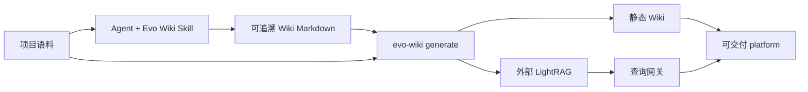

# Evo Wiki 架构说明

Evo Wiki 1.0.1 是“Agent 生成内容，CLI 构建平台”的知识平台生成器。



Agent 负责理解语料、组织页面和处理证据缺口；Python 负责可重复、可验证、可恢复的工程动作。
默认交付完整 platform，`--target wiki` 是明确的纯文档分支。

## 1. Workspace 边界

工具源码与项目运行数据分离。所有运行时路径都相对于 `--root`：

```text
workspace/
  corpus/                         原始语料
  project.json                    运行、安全和 profile 配置
  wiki.json                       品牌、导航、查询默认值
  lightrag-config.json            本地服务配置，禁止提交
  artifacts/
    state/evo_wiki.sqlite3
    query-audit/open/               待审核的受保护问答快照
    generation/report.json
    wiki/
    lightrag/
    platform/
    logs/
```

`corpus/` 是输入，不由生成器改写。`artifacts/` 是可重建产物和状态，不应与工具源码混放。

## 2. 模块职责

- `evo_wiki.cli`：公共命令入口和稳定退出码。
- `evo_wiki.config`：profile、平台个性化配置和严格校验。
- `evo_wiki.generation`：完整生成事务边界。
- `evo_wiki.orchestration`：`run` 与 `generate` 复用的 Wiki/LightRAG 工作流编排。
- `evo_wiki.corpus`：语料扫描、哈希和 change set。
- `evo_wiki.wiki`：Markdown 渲染、搜索索引、链接图和基础质量检查。
- `evo_wiki.lightrag_lane`：LightRAG 输入准备、能力检查、提交和 track 轮询。
- `evo_wiki.state`：SQLite 状态、迁移、备份、对账和受控运维。
- `evo_wiki.query_gateway`：查询 DTO、证据门禁、绑定关系解析和审计状态。
- `evo_wiki.gateway_http`：查询网关 HTTP 层，以及本地静态站合并服务。
- `evo_wiki.platform_export`：staging 构建和平台原子切换。
- `evo_wiki.spa_assets`：问答、图谱和实体枢纽 SPA。

## 3. Generate 编排

普通用户使用：

```bash
evo-wiki generate --root /path/to/workspace
```

固定流程：

```text
只读配置和语料预检
  → immutable SQLite 当前 binding gate 检查
  → legacy JSON 自动切换 SQLite
  → SQLite schema backup-first 自动升级
  → state verify
  → Wiki render + lint
  → LightRAG preflight + submit + track
  → query gateway check
  → staging 构建
  → artifacts/platform 原子切换
```

`generate --dry-run` 不写 workspace，不创建 SQLite sidecar，不提交 LightRAG，也不替换平台。
当前语料已有 `UNKNOWN/BLOCKED` binding 时，它返回 `status=blocked` 和
`GENERATION_RECONCILE_REQUIRED`，只公开阻断数量及 review/apply/retry 命令。正式生成执行同一
检查，并在 Wiki staging 改写前停止。

正式执行使用单主机生成锁。失败规则：

- 配置、迁移或状态校验失败：不进入内容工作流；
- Wiki stub 或质量失败：不提交 LightRAG；
- LightRAG 或查询网关失败：不替换已有平台；
- 语料删除触发 `requires_rebuild`：停止，不自动删除、替换或重建远端数据；
- staging 构建失败：保留上一个完整平台；
- 当前 schema 已是最新版本：不重复创建迁移备份。

生成报告只保存步骤、版本、备份信息、写入标记、产物路径和稳定错误码，不保存密钥、问题正文、
答案正文或远端响应正文。

## 4. 内容工作流

Wiki 和 LightRAG 是两个隔离的工作流（lane）：

```text
corpus → Wiki Markdown → 静态 HTML
corpus → LightRAG 输入 → 外部 LightRAG
```

二者都以原始语料为输入，但不共享索引、运行基线或报告。生成的 Wiki 不默认再次进入
LightRAG，避免模型整理结果污染原始检索证据。

Agent 维护：

```text
artifacts/wiki/wiki-src/
  index.md
  concepts/
  entities/
  sources/
```

Python 不调用模型 API，因此初始化 stub 必须先由 Agent 完成。完整 platform 对 stub 设置质量门禁。

实体 frontmatter 可声明 `graph_label` 与 `aliases`；缺省 graph label 为页面 title，重复 label
属于映射完整性错误。渲染器公开 `wiki-registry.json`，只包含实体到 Wiki slug 以及 source
basename 到来源页的唯一映射，不包含 workspace 绝对路径。概念/实体页据此展示“来源依据”，
Wiki 和图谱也通过同一注册表双向跳转。

## 5. LightRAG 边界

LightRAG 是明确配置的外部服务。Evo Wiki 不安装、不启动、不管理它。

写入前必须确认：

- `base_url` 已明确配置；
- `workspace` 已明确配置并符合命名规则；
- `/health` 和 `/openapi.json` 可访问；
- 服务 workspace 与 storage workspace 映射匹配；
- track status、chunk content、`conversation_history` 等必需能力存在。

每次提交后只轮询本次返回的 track。只有所有目标文档达到 `processed` 且存在有效 chunk，才记录
成功绑定关系。HTTP 409、响应丢失、超时、未知状态和删除都保持失败闭锁。

测试套件中的 Mock LightRAG 只模拟协议端点，用于验证 Evo Wiki 编排，不代表真实 LightRAG
安装、索引或检索效果验收。

## 6. SQLite 状态边界

新 workspace 直接创建当前 schema 的：

```text
artifacts/state/evo_wiki.sqlite3
```

SQLite 是唯一业务状态事实源。兼容 JSON、manifest、报告、进度和 journal 都是投影或过程证据，
不能作为回退事实源。

已有 legacy workspace 在独立运维命令下仍保持 legacy；首次正式 `generate` 会在只读预检通过后
自动执行可续接 cutover：

1. 原字节备份 legacy JSON 和 `project.json`；
2. 构建并校验候选数据库；
3. 安装数据库；
4. 原子替换配置。

数据库安装与配置替换分别原子，但不是跨文件 ACID 事务。中断后，普通写入失败闭锁；重新执行
`generate` 或 `migrate-state --apply` 会识别并续接支持的状态。

schema 使用不可变迁移链：

- v1：source、revision、lane run、partition 和 LightRAG binding；
- v2：单文档 replacement operation；
- v3：query lease、maintenance fence、gateway heartbeat 和 audit；
- v4：notification outbox 和 delivery attempt。
- v5：query generation/origin/evidence/review 四类交付状态及审核快照指针。

升级前使用 SQLite Backup API 创建并验证备份。已应用 migration 的名称和 checksum 不允许修改。

## 7. 查询网关

生产读取路径固定为：

```text
Browser → Nginx/认证 → 查询网关 → LightRAG
```

浏览器和 Nginx reader 路由不得绕过查询网关直连 LightRAG。

查询网关会：

1. 检查维护 fence 并创建有界 query lease；
2. 检查 LightRAG workspace、结构化引用和 `bypass` 能力；
3. 校验最多 3 个完整 user/assistant 对的受控上下文，并强制请求 references 和 chunk content；
4. 遍历全部引用，将非空片段唯一映射到 `ACTIVE + PROCESSED/OPEN` 绑定关系；
5. 执行来源、整体词法相关性和关键字面事实检查，并保留所有有效引用；
6. 首轮没有有效引用、回答为空或返回拒答文本时，以 `mode=bypass` 调用同一 LightRAG 服务；
7. 最终非空回答一律以 `generation_status=succeeded` 返回；证据和人工审核状态不阻断正文。

当前 `provenance_critical_fact_v1` 是保守证据门禁，不是完整语义蕴含证明，也不承诺引用精度。

schema v2 客户端可以不发送历史；发送时单条最多 4,000 字符，总计最多 12,000 字符，角色必须
严格交替并以 assistant 结束。所有成功展示的回答都可进入下一轮；验证相关性使用历史 user
问题与当前问题，完整请求统一生成 HMAC。

响应的四个维度互不替代：

| 字段 | 值 | 含义 |
| --- | --- | --- |
| `generation_status` | `succeeded / failed` | 最终是否生成非空回答 |
| `answer_origin` | `knowledge_base / general_model / null` | RAG 回答或 bypass 通用回答 |
| `evidence_status` | `grounded / partially_grounded / ungrounded / null` | 可核验知识库依据覆盖情况 |
| `review_status` | `not_required / pending / approved / rejected / unavailable` | 人工审核生命周期 |

`partially_grounded` 和 `ungrounded` 会写入
`artifacts/query-audit/open/<audit-id>.json`。快照包含问题、已展示答案和证据，使用原子写入和
`0600` 权限；SQLite 只保存相对路径、SHA-256、HMAC、状态和计数，不保存正文。审核者必须显式
执行 `audit show --include-content` 才读取快照；`audit resolve --resolution
APPROVED|REJECTED` 结案并删除快照。快照写入失败时答案仍交付，
`review_status=unavailable`，并记录运维错误。

SPA 对三种成功证据状态分别显示“已引用知识库资料”“部分依据待核验”和“未检索到知识库依据，
此回答由模型通用知识生成”。正文不折叠；行内 `[n]` 定位到“回答依据 → 片段 → Wiki 来源”
证据卡。模型自由格式 References 会被剥离，只有结构化 citations 作为来源。

存在 citations 时，SPA 在回答交付后异步拉取一个展示型小子图。seed 只允许来自：

1. 引用对象显式携带的实体 `graph_label`；
2. `wiki-registry.json` 中由实体页 `sources` 建立的“引用文档 → graph label”映射。

多个候选按当前问题关键词与其对应引用片段的确定性词项相关性降序选择。图响应必须包含与
候选 label 经 NFKC/大小写归一化后精确相等的节点 ID 或 label；不做包含匹配，也不回退到
首节点。展示型子图固定为 depth 1、最多 24 个节点、最多 3 个 seed 尝试。候选均未精确命中、
图响应为空、超时或不可用时只移除子图区，不修改 `generation_status`、`evidence_status` 或
`review_status`。独立图谱页仍默认 depth 2 / 50 节点，使用确定性 BFS 分层、客户端上限、
标签碰撞控制、缩放/复位与键盘节点操作；节点选择不会立即导航。

## 8. 本地预览与生产导出

`evo-wiki serve` 将生成平台和查询网关挂载到同一个 loopback 端口：

```text
/            Wiki
/app/        SPA
/api/*       查询网关
```

它只允许 `local_single_user`，不负责 TLS、OAuth 或公网访问，并封禁状态、数据库、配置、
README 和 Nginx 等私有路径。

生产使用 `production-export` profile 和 `artifacts/platform/nginx.conf`。TLS、认证、rate limit
和外部访问控制位于 Nginx 或上游反向代理；LightRAG 凭据只存在于查询网关进程。

## 9. 单文档替换与维护排空

HTTP 409 的 `state replace-*` 是独立运维流程，不属于 `generate`，也不是批量替换功能。

每次受控替换需要：

- 零写入 `replace-plan`；
- 完整 `plan_digest` 确认；
- 新的已验证 SQLite 备份；
- 每个 DELETE/POST 前先提交本地 intent；
- 空闲 pipeline、唯一远端归属和 bounded smoke evidence；
- 查询网关 heartbeat 和 reader lease 排空。

未知副作用进入 `NEEDS_AUDIT`，不会自动重放。已知失败只在目标可唯一归属且补偿边界明确时回滚。

## 10. Evidence Subgraph

Evidence Subgraph 是 wheel 内的开发者运行时 Skill，不注册为普通 UI Skill。它执行：

```text
显式 seed
  → 有界子图
  → ACTIVE 来源映射
  → content-unit allow-list
  → allow-list 内检索
  → scope assertion
  → 证据 + 脱敏 trace
```

它不生成答案，不调用 LightRAG `global` 搜索，不提供无边界 fallback。workspace 不一致、来源
无法映射、预算耗尽、图被截断或返回越界证据时必须 fail closed。

## 11. 支持范围

1.0.1 的部署假设：

- 单主机；
- 本地文件系统；
- 单 workspace；
- 外部已有 LightRAG；
- 生成后退出，独立 `serve` 或 Nginx 负责运行。

多域 ACL、OAuth/RBAC、NFS/SMB、多主机、零停机和批量替换不在当前版本范围内。这些能力不是
生成平台的前提，也不会出现在默认工作流中。
