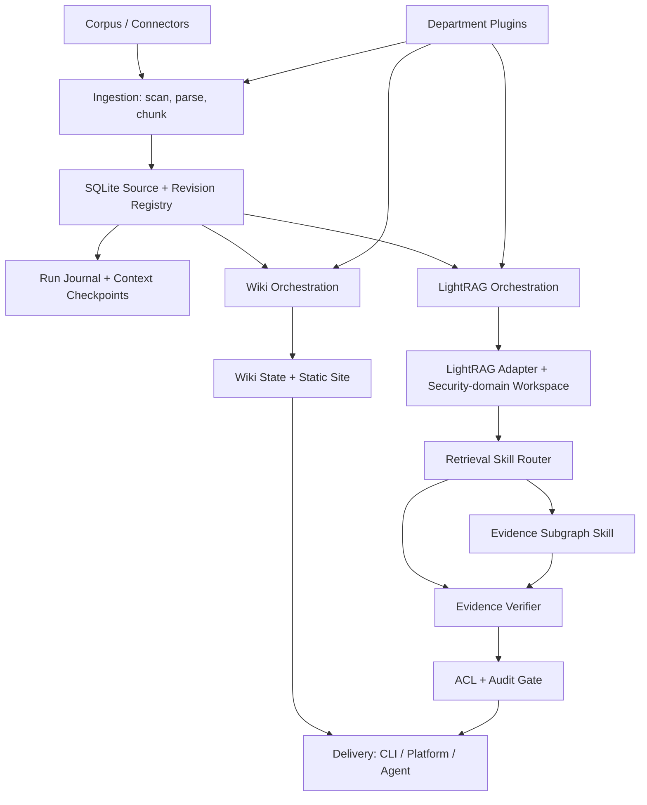
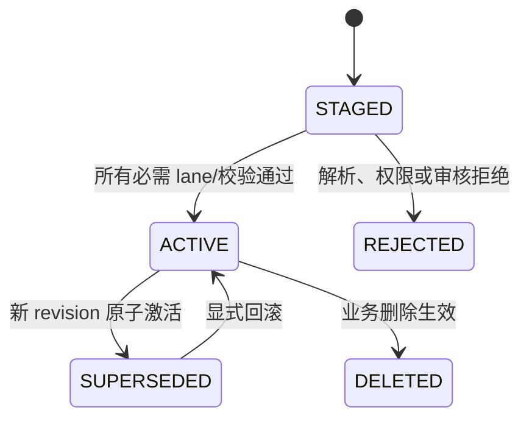
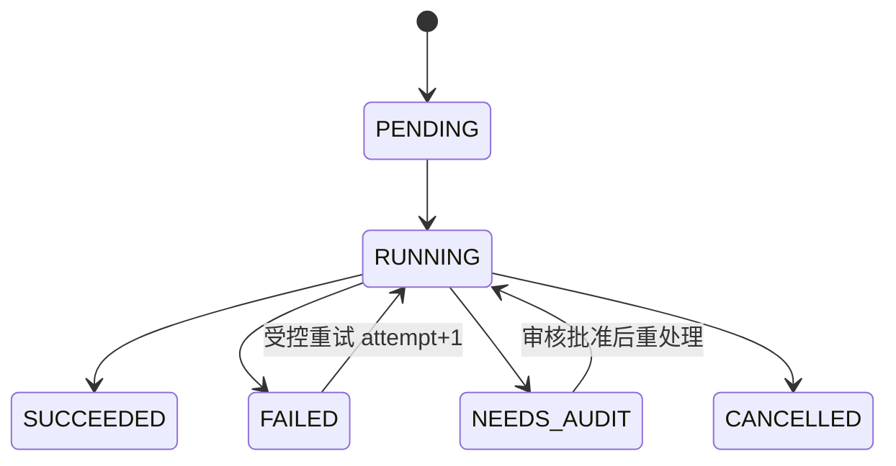
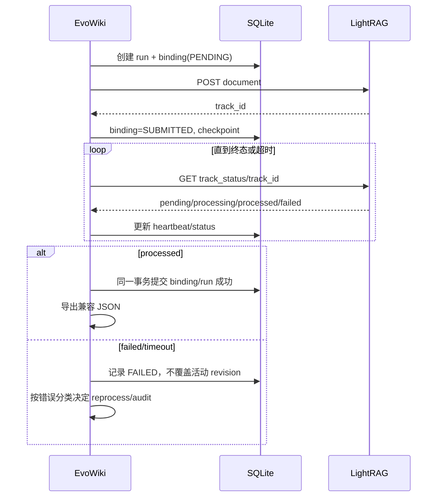

# EvoWiki 渐进式优化技术报告

> 面向读者：EvoWiki 研发、测试、部署与安全评审人员
>
> 报告状态：实施指南（截至 2026-07-20；区分已完成、部分完成、历史验收与待实施）
>
> 基线日期：2026-07-17
>
> 建议部署基线：单机内网、SQLite WAL、本地或内网 LightRAG 服务

## 1. 执行摘要

EvoWiki 当前已经具备一个清晰但偏 MVP 的骨架：Python CLI 负责语料扫描、文件级 SHA-256 变更检测、静态 Wiki 渲染、LightRAG 输入准备、外部服务提交以及只读平台导出；Wiki lane 与 LightRAG lane 拥有独立状态和输出目录。项目的产品目标不是构建一个法律专用知识库，而是形成一个**领域无关、可由不同部门二次开发的政务知识底座**：法务、公安、税务、财政、人社、市场监管或综合办公团队，都可以在不修改核心状态机和安全边界的前提下，通过 Cursor、Codex、Windsurf 等 AI 编程工具增加领域 schema、parser、extractor、workflow、prompt 和页面插件。现有法律语料只是首个端到端验证集，不能定义核心架构。

本报告建议**保留现有 CLI、双 lane 和产物路径，以渐进方式重构状态、同步、证据与治理链路**，而不是整体推倒重写。目标形态可概括为：

```text
领域无关契约 + 部门插件 + 不可变语料版本 + SQLite WAL 状态机
      + append-only 运行日志 + Agent 上下文检查点
      + 可替换解析/检索适配器 + 证据子图检索 Skill
      + 检索前授权 + 证据与审计闭环
```

最优先的工作不是引入更多高级算法，而是修复仍会导致“假成功、旧知识残留、证据不足或越权”的生产阻断项。以下清单的状态已按当前代码更新：

1. LightRAG 异步提交、bounded polling 和 processed 后提交本地成功状态已实现；响应丢失、failed、missing、timeout 与格式异常会进入 `UNKNOWN/FAILED/MISSING + BLOCKED`。HTTP 409 已结构化闭锁，并具备零写入计划与默认关闭的生产替换状态机。
2. 单文件内容修改遭遇同名文档 HTTP 409 时，不保存原始响应或盲目重试；`state replace-plan` 核对唯一远端文档、旧 track、删除影响和回滚 snapshot。LR-004B 通过 schema v2 operation、plan digest、自动验证备份、单次副作用 intent、删除终态确认、processed/evidence 验收及可归属补偿回滚实现受控执行；未知副作用始终进入 `NEEDS_AUDIT`。
3. EvoWiki 的 `embedding.batch_size` 只表达客户端期望，不能改变 LightRAG 服务进程的 `EMBEDDING_BATCH_NUM`；现已可通过 `doctor --check-service` 做只读核对，但尚未把不一致自动阻断写入工作流。
4. QG-001 已把 Web/CLI 问答收敛到可信查询网关：服务端强制 chunk content，
   遍历全部引用、映射唯一 ACTIVE revision，并将回答生成、证据质量和人工审核拆成
   四个独立状态。没有可用证据、首轮空回答或拒答文本会触发同一 LightRAG 服务的
   `mode=bypass`；只要最终回答非空就立即交付。完整语义蕴含、citation precision
   黄金集和多域 ACL 仍未完成。
5. P1-A 已使 SQLite WAL 成为新 workspace 和显式迁移后 workspace 的唯一业务状态事实源；JSON 已退化为命令边界兼容导出。schema v3 已补 query lease/gateway heartbeat；完整 context/resume 与跨存储提交协议仍未实现。
6. schema v3 已增加 query audit 队列和 `audit list/show/resolve`；schema v4
   增加 notification Outbox、attempt、claim/retry 和 HMAC Webhook；schema v5 为
   `query_run` 增加 generation/origin/evidence/review 状态。`partially_grounded` 和
   `ungrounded` 会进入 audit，但不阻断回答；待审核问题、回答和证据保存在权限为
   `0600` 的独立快照中，SQLite 只保存相对路径与哈希。完整 rubric、SLA 和审核网页仍未实现。
7. `export-platform` 不复制内部 status，并让 Nginx 把全部 RAG reader 流量转发到
   loopback/private query gateway；配置已包含 trusted identity、限流、body/timeout
   控制。QG-001 已在隔离环境实测 Docker Nginx Basic Auth、签名告警和维护排空；
   现有 9 文档 workspace 的实际切流、OAuth/RBAC 和公网验收仍需独立审批。
8. 当前运行的 LightRAG 查询 API 未确认具备按允许文档集合过滤的能力。细粒度 ACL 不能靠回答后裁剪实现；首版必须按安全域隔离 workspace/service，无法安全路由时拒绝查询。
9. LOG-001B 已将 `run` 接入独立 run journal，migration/backup/reconcile 也写运维事件：事件具备严格 schema、连续序号、规范化 hash chain、`flock`、fsync、私有权限和只读 `logs verify`；旧全局 JSONL 可显式 dry-run/apply 迁移并标记 `legacy_unverified`。它仍不包含 retention、显式 close/root hash、Markdown context checkpoint、resume protocol 或 journal/SQLite 跨存储提交协议。
10. 语料扩展后不应无条件启动 LightRAG 全局检索。底座应内置可开关、可版本化的 `evidence-subgraph` 检索 Skill：先用查询定位种子实体/概念，在权限内扩展有上限的子图，将节点与边映射到 ACTIVE revision 的原始 content units，然后只在这些证据中检索、重排和作答。子图用于缩小候选空间，不是用节点摘要取代原文证据。

建议分四阶段实施：P0 先解决安全与同步正确性，P1 引入 SQLite、运行日志、上下文检查点与公共契约，P2 构建 provenance、版本链、audit、安全域、部门插件骨架和证据子图 Skill，P3 再推进复杂文档、插件 SDK 与高级检索。按一名熟悉 Python、SQLite 与 RAG 的全职工程师估算，达到可受控跨部门试点约需 12–19 人周；达到较完整的工业化底座约需 17–27 人周。估算不包含模型服务采购、政务等保测评、各领域专家标注和部门业务插件的定制开发。

### 1.1 当前实施快照（2026-07-20）

| 工作项 | 当前状态 | 已验证事实 | 不应误读为 |
| --- | --- | --- | --- |
| 可校验运行日志 | **部分完成（LOG-001B）** | 每次 `run` 使用独立目录；迁移/备份/reconcile 写运维事件；严格事件契约、跨分段连续 hash chain、锁/fsync、权限、`logs verify` 和 legacy 显式迁移已有测试与离线实验 | 尚无 retention、显式 close/root hash、context checkpoint、resume、journal/SQLite 跨存储提交协议或外部可信时间戳 |
| SQLite 状态底座 | **P1-A1/A2 完成（限定范围）** | 新 workspace 默认 SQLite；legacy 显式 dry-run/apply；可恢复 cutover、兼容导出、分层 verify、在线 backup、binding 闭锁/reconcile、并发与崩溃点测试已落地 | 不等于完整 P1：尚无 lease/heartbeat、context/resume、restore/retention、ACL/content-unit/version chain 或多主机能力 |
| SEC-001 platform 状态隔离 | **完成（代码/测试范围）** | 不再导出 status 快照；生成的 nginx 封禁 `/status/`、部署配置和 README | 不等于公网网关已具备认证、限流和安全审计 |
| EV-001 chunk evidence | **部分完成** | 网关请求 chunk content、遍历全部引用、保留可映射且相关的证据，并对混合有效/无效引用和关键事实缺口标记 `partially_grounded` | 不等于每条回答已经通过语义蕴含证明或引用精度黄金集验收 |
| QG-001 可信查询控制面 | **schema v5/API v2 已实现；新版真实验收未运行** | generation/origin/evidence/review 四状态、LightRAG bypass、成功答案始终交付、受保护审核快照、CLI 审核删除、SPA 三态提示与证据卡已有模拟测试；旧 schema v4 运维路径有历史隔离验收 | 不等于新版 bypass 已在真实服务跑过、多域 ACL、OAuth/RBAC 已部署或现有 9 文档 workspace 已升级/切流 |
| LR-001 capability discovery | **部分完成** | `doctor --check-service` 只读读取 `/health` 与 `/openapi.json`，发现 chunk/track/delete 与 batch 等能力 | 不等于已实现轮询、远端状态恢复或写入前强制 gate |
| CLI-001 doctor/state | **部分完成** | doctor 默认本地检查并可选在线 JSON；state/migration 命令具备稳定机器输出、退出码和 SQLite 分层校验 | doctor 尚无人读摘要切换；完整全 CLI error envelope 未统一 |
| 异步同步与 409 | **LR-004A/B 完成（单 workspace 限定）** | track polling、409 闭锁、零写入计划、schema v2 operation、默认关闭的 digest/backup 门禁执行、删除终态、processed/evidence 验收、补偿与 crash 不重放测试已实现；独立真实 workspace 的成功替换和补偿回滚均通过 | 不等于零停机、RBAC、批量替换或全库 restore；现有 9 文档生产 workspace 未做破坏性验收 |

当前真实服务的只读探测结果为：`core_version=1.5.4`、`api_version=0313`、远端 embedding batch=`8`；chunk content、track status、document inventory、pipeline status 与 document delete API 可发现，workspace 与全部已报告存储 workspace 均为 `evo_wiki`。因此后续实现必须继续按 capability detection 行事，不能仅凭版本字符串放行功能。

## 2. 报告依据与证据纪律

### 2.1 输入材料

本报告使用以下本地材料，不读取或记录任何密钥：

- [OpenWiki 基础能力评估报告](../../openwiki_test_report.md)
- [EvoWiki 基础能力评估报告](../experiment/evo_wiki_test/evo_wiki_test_report.md)
- [LightRAG embedding batch 修复报告](../experiment/evo_wiki_test/lightrag_fix_report.md)
- [EvoWiki 首次知识库生成记录](../experiment/evo_wiki_test/init_report.md)
- [修复后验收原始日志](../experiment/evo_wiki_test/logs/22_lightrag_post_fix_acceptance.log)
- [增量重提 409 原始日志](../experiment/evo_wiki_test/logs/12_run_lightrag_incremental.log)
- [修复前 pipeline 原始日志](../experiment/evo_wiki_test/logs/15_lightrag_pipeline_status.log)
- [DeepResearch 政务级通用底座白皮书](<../../deep-research-report (1).md>)
- EvoWiki 当前实现：[CLI](../src/evo_wiki/cli.py)、[corpus 扫描](../src/evo_wiki/corpus.py)、[LightRAG adapter](../src/evo_wiki/lightrag_lane.py)、[平台导出](../src/evo_wiki/platform_export.py)
- LightRAG 本地官方源码和文档：[API Server 文档](../../lightrag/docs/LightRAG-API-Server.md)、[document routes](../../lightrag/lightrag/api/routers/document_routes.py)、[query routes](../../lightrag/lightrag/api/routers/query_routes.py)

DeepResearch 中的 `turn...` 引用标记不是可复用 URL，因此只作为二手研究输入。本报告涉及当前 LightRAG 行为的关键结论，均以本地源码、官方仓库内文档或原始实验日志重新核对；实际运行版本由 `doctor --check-service` 读取，而不是由文档或源码目录名推断。没有核对的建议统一标记为待验证，不包装成已实现或已证明的事实。

### 2.2 证据等级

| 标记 | 含义 | 可用于什么结论 |
| --- | --- | --- |
| **E：实测** | 有命令、日志、产物或测试结果 | 当前环境中的实际行为与数值 |
| **C：代码确认** | 当前源码或官方仓库内文档明确支持 | 实现形状、API 能力与边界 |
| **R：研究建议** | DeepResearch 或相关工程方法给出方向 | 技术选型与候选方案 |
| **H：待验证假设** | 尚无本地公平实验 | 不能写成效果结论，只能进入实验计划 |

任何性能、准确率或“优于某方案”的表述，都必须能回指原始结果。超时、失败和空引用行必须保留；不能从一次 smoke query 推断总体问答质量，也不能从文档成功提交推断后台索引成功。

### 2.3 已确认基线

| 项目 | 当前结果 | 等级 | 证据 |
| --- | --- | --- | --- |
| EvoWiki 回归测试 | `189 passed` | E | [STATUS](../STATUS.md)、[测试](../tests/) |
| 测试语料 | 9 份 UTF-8 `.txt`，115345 字节 | E | [数据集摘要](../experiment/evo_wiki_test/source_stats/dataset_summary.txt)、version1 文件 |
| CLI-only Wiki | 只渲染 1 个 stub，不自动生成法律知识页 | E | [03_run_wiki.log](../experiment/evo_wiki_test/logs/03_run_wiki.log) |
| Agent-assisted Wiki | 6 页，health clean；其中 1 个 source 页保留全文 | E | [wiki-report.json](../experiment/evo_wiki_test/artifacts/wiki/reports/wiki-report.json) |
| LightRAG 修复前 | `pending=8, failed=1, processed=0`，embedding batch 32 触发上游 400 | E | [15_lightrag_pipeline_status.log](../experiment/evo_wiki_test/logs/15_lightrag_pipeline_status.log) |
| LightRAG 修复后 | 9/9 processed，34 chunks，单文档 3–5 chunks | E | [22_lightrag_post_fix_acceptance.log](../experiment/evo_wiki_test/logs/22_lightrag_post_fix_acceptance.log) |
| LR-004B 隔离验收 | 成功替换 1 DELETE/1 submit；evidence 失败补偿 2 DELETE/2 submit；终态 1 processed/1 chunk、SQLite PASS | E | [脱敏验收摘要](../experiment/lr004b_acceptance_summary.json) |
| QG-001 历史运维验收 | 旧 schema v1→v4 副本迁移、Docker Basic Auth、旧 Shadow/Enforce 交付语义、HMAC Webhook、audit、三类 DELETE=0 blocker、在途查询 503、受控替换和清理通过；源 workspace 仍为 v1/seq15/9文档/34 chunks | E（历史） | [脱敏验收摘要](../experiment/qg001_ops_acceptance_summary.json) |
| Smoke query | 1184 字符、5 条文件级 references、未出现 `no-context` | E | [smoke-test.json](../experiment/evo_wiki_test/artifacts/lightrag/queries/smoke-test.json) |
| 引用粒度 | 5 条 references 的 `content` 均为 `null`，回答正文只显式列出其中 1 个编号 | E | [smoke-test.json](../experiment/evo_wiki_test/artifacts/lightrag/queries/smoke-test.json) |
| 当前引用实现 | smoke/SPA 请求 `include_chunk_content=true`；Python 将 string/null/list 规范为 `list[str]` | C + E | [LightRAG adapter](../src/evo_wiki/lightrag_lane.py)、[SPA](../src/evo_wiki/spa_assets.py)、[测试](../tests/test_fixes.py) |
| 当前能力探测 | `doctor --check-service` 读取 health/OpenAPI；真实服务报告 core `1.5.4`、batch `8`、workspace unknown | E | [STATUS](../STATUS.md)、[LightRAG adapter](../src/evo_wiki/lightrag_lane.py) |
| 增量修改 | 单文件修改被扫描识别，但向 LightRAG 重提同名文档返回 HTTP 409 | E | [09_scan_incremental.log](../experiment/evo_wiki_test/logs/09_scan_incremental.log)、[12_run_lightrag_incremental.log](../experiment/evo_wiki_test/logs/12_run_lightrag_incremental.log) |
| OpenWiki 初始化 | GLM 完成 3 个 Markdown 页面、374 行，约 6 分钟 | E | [OpenWiki 报告](../../openwiki_test_report.md) |
| OpenWiki 增量 | 非实质标记变更后仅 `quickstart.md` 变化，约 2 分钟 | E | [OpenWiki 报告](../../openwiki_test_report.md) |

上述结果只证明小规模法律文本上的基础闭环。法律案例在本报告中是 **seed validation pack**，不是产品边界；现有实验没有证明跨部门通用性、复杂格式覆盖、百万 chunk 可扩展性、领域准确性、统计显著性、版本替换正确性、崩溃恢复或权限安全。

### 2.4 关键 claim-evidence 对齐

| 结论 | 支撑证据 | 仍缺少的证据 |
| --- | --- | --- |
| EvoWiki 可以调用外部 LightRAG 完成索引与查询 | 9/9 processed、34 chunks、非空回答 | 清库后的全新重复实验、更多查询与多次运行 |
| batch 失败根因是 provider 上限 10 与服务配置 32 冲突 | provider 400 日志；改为 8 后不再出现同类错误 | 不同 embedding provider 的能力探测与边界表 |
| 当前 ledger 成功语义不可靠 | adapter 在提交后立即写 ledger；首次索引实际后台失败 | 新状态机在故障注入下的恢复实验 |
| 当前引用不足以做高风险业务证据核验 | references 只有文件名，chunk 内容为空 | 请求 chunk content 后的引用准确率、锚点映射率 |
| 当前增量更新不闭环 | 单文件修改后 409 | 删除—重建—回滚完整实验 |
| SQLite WAL 适合作为单机状态源 | DeepResearch 论证与 SQLite 已知模型 | 本项目状态规模、并发和故障注入基准 |
| LightRAG 比纯向量方案更适合跨文档、多实体关联问题 | 研究方向与图检索设计 | 至少三个部门语料包上 `naive` 与 graph modes 的公平对比 |
| 证据子图可以减少大语料查询候选空间 | GraphRAG、Neo4j GraphRAG、LlamaIndex Property Graph 等开源项目证明“图扩展 + 证据检索”是可实现模式 | EvoWiki 本地的子图召回、候选缩减率、时延、成本及回答质量非劣实验 |
| OpenWiki 可提供 Agent 文档维护经验 | 3 页初始化和一次增量成功 | 它不是检索系统，不能作为 RAG 效果 baseline |

## 3. 当前架构诊断

### 3.1 已有优势

1. **lane 边界清楚。** Wiki 和 LightRAG 分别维护状态、报告与产物，一条 lane 失败不应损坏另一条 lane。
2. **运行数据与工具源码分离。** `workspace/corpus` 和 `workspace/artifacts` 作为运行边界，便于审计和测试隔离。
3. **文件级增量检测可靠且透明。** 当前扫描记录路径、SHA-256、大小、后缀和 text-like 标记。
4. **产物对 Agent 友好。** Markdown、JSON、JSONL、HTML 可直接检查，Wiki 支持 wikilink、反向链接、搜索与原文页。
5. **LightRAG 适配器保持轻量。** EvoWiki 没有把外部向量库或图数据库硬编码进本地进程，替换后端仍有空间。
6. **OpenWiki 提供了可借鉴的工程模式。** 集中的 provider 配置、Git 证据、内容 snapshot、无变化不更新 metadata、流式事件和 docs-only 写入保护，都值得移植到 EvoWiki 的 orchestration 层；但不应直接复制其“由 Agent 自主决定修改范围”的非确定性策略到高风险索引事务中。

### 3.2 Must-fix issues

| 编号 | 问题 | 当前状态 | 直接风险/下一动作 |
| --- | --- | --- | --- |
| M1 | 提交成功被误当成处理成功 | **完成（当前提交/轮询范围）** | 已接入 bounded polling、processed 后成功、失败闭锁 binding 与只观察 reconcile；不代表 409 replace/delete 已完成 |
| M2 | 修改文档重提 409 | **完成（单 workspace 单文档范围）** | 409 闭锁、零写入计划、备份/digest 门禁、删除终态、processed/evidence 验收、补偿回滚和未知副作用不重放已实现；零停机与批量替换不在本卡范围 |
| M3 | batch 配置语义失真 | **部分完成** | `doctor --check-service` 已核对远端 batch，本地值已标为 expectation；下一步是在写入前按策略阻断 mismatch |
| M4 | references 无 chunk 内容 | **部分完成（QG-001 v1 闸门完成）** | 服务端强制非空 chunk、ACTIVE binding、明显相关性和关键字面事实；回答先持久化 verdict 再交付 | 完整语义蕴含、稳定 anchor/chunk ID 和 citation precision 黄金集仍待完成 |
| M5 | JSON 是运行状态事实源 | **P1-A 完成** | SQLite 是 cutover 后唯一业务事实源；JSON 为可重建兼容导出；context/resume 和多主机能力不在本阶段 |
| M6 | audit 不参与运行时 | **部分完成** | query gate 可创建脱敏 audit 并由 CLI 显式裁决；原问题/回答/引用正文不持久化 | 完整冲突/version rubric、分派 SLA 和工作台仍待完成 |
| M7 | `/status/` 位于公开静态根 | **代码完成、部署待验收** | 状态隔离、gateway-only reader 路由、trusted principal、限流/body/timeout 配置已有测试 | OAuth/密码文件、告警与公网部署仍由运维提供 |
| M8 | 无检索前 ACL | **部分完成（单域边界）** | gateway 在检索前绑定唯一 partition/security domain，映射不确定时 fail closed | principal grants、多域 fan-out 和同 workspace 文档级 ACL 未实现 |
| M9 | Wiki 内容更新不由 CLI 驱动 | **未开始** | corpus 变化后页面可保持陈旧；建立 revision→page dependency 与需重编译队列 |
| M10 | 无稳定证据 ID | **未开始** | 文件重命名、切分调整会破坏引用；使用 `revision_id + content_unit_id + anchor` |
| M11 | 无长工作流日志/上下文检查点 | **部分完成** | LOG-001B 已完成独立 run journal、跨分段 hash 验证与 legacy 迁移；P1 仍需 retention、close/root hash、context snapshot、checkpoint manifest 和 resume |

### 3.3 Should-fix issues

- 建立领域无关 parser/chunker/extractor/workflow 插件协议，区分纯文本、结构化制度、长事实叙述、表格数据和复杂版式文件。
- 为 source、revision、content unit、graph mutation 建立版本链和 provenance。
- 引入 Pydantic 公共 DTO、JSON Schema 和明确错误码，使 CLI、插件、测试与未来 API 共用契约。
- 建立三层日志与恢复模型：SQLite 机器状态、append-only JSONL 事件、Agent 可读 Markdown context checkpoint。
- 提供 LightRAG capability discovery，检查 API、workspace、embedding、rerank、parser、chunk-content、delete 和 track-status 能力。
- 将检索策略定义为可版本化 Skill；以 corpus profile 和查询类型选择全局/混合或证据子图，并保存可解释、可回放的 retrieval plan。
- 支持受控的失败重处理，但区分“幂等状态查询”“安全重试”和“可能重复提交”的操作。
- 为 Wiki 生成引入内容 snapshot 和 no-op 判定，减少无意义重渲染与 metadata churn。

### 3.4 Nice-to-have issues

- HippoRAG/PPR 风格多跳检索插件。
- 领域冲突检测与跨版本映射；法规效力、税务口径、案件关系等由部门插件分别实现。
- 复杂行业 schema、低代码配置器和前端审核工作台。
- 多节点高可用、外置关系数据库和分布式任务队列。
- 图谱可视化 diff、版本回放与分支式知识实验。

这些能力必须建立在状态、证据、权限和评测稳定以后。当前没有本地证据证明 PPR、GraphRAG 社区摘要或某一种语义切分一定优于现状，因此它们属于候选实验，不属于承诺效果。

## 4. 目标、边界与架构原则

### 4.1 目标

- 核心层只提供文档版本、任务编排、检索抽象、权限、证据、审计和交付协议，不硬编码任何部门的实体类型、业务规则或页面流程。
- 部门开发者可以借助 Cursor、Codex、Windsurf 等工具，从模板生成独立插件，并通过 manifest、Pydantic schema、Protocol、fixtures 和质量门禁接入底座。
- 每份文件拥有稳定逻辑身份和不可变 revision；所有下游结果可回指 revision。
- 每个阶段是幂等、可枚举、可恢复的状态转移；SQLite 用于机器恢复，文件日志用于事件回放与 Agent 上下文续接，两者职责明确。
- Wiki 与 LightRAG 可独立运行、失败和回滚，同时使用同一份只读 source/revision registry。
- 每个回答携带结构化 citations；高风险或证据不足回答进入 audit，而不是静默返回。
- 权限过滤发生在检索之前；后端做不到时拒绝执行，不使用生成后过滤作为安全措施。
- 公共扩展点由 Protocol 和 Pydantic schema 定义，业务插件不依赖内部表结构。
- 检索策略通过类 Skill 契约接入，能按语料规模、能力和风险策略路由；大语料模式默认不允许静默降级到无边界的全局搜索。

### 4.2 非目标

- 首版不支持多个主机同时写同一个 SQLite 文件，也不把 SQLite 放在 NFS/SMB 上。
- 不在 EvoWiki 内重写 LightRAG 的图、向量和 LLM pipeline。
- 不在核心包中内置“公安案件”“税务核验”“法规判断”等部门业务逻辑，也不承诺自动产出的专业结论可以替代领域人员审核。
- 不把历史 revision 全部同时放进当前 LightRAG 活跃 workspace 后再靠 prompt 选择“最新”。
- 不在没有公平实验时宣称 LightRAG、PPR、GraphRAG 或某一模型具有统计显著优势。

### 4.3 总体分层



代码依赖方向固定为：

```text
contracts
  ↑
interfaces
  ↑
orchestration
  ├── ingestion / parsing / extraction
  ├── adapters / storage
  └── governance / audit / security
  ↑
cli / delivery
```

`contracts` 和 `interfaces` 不引用具体 storage、LightRAG 或页面渲染实现。业务插件只能依赖公共 facade、DTO 和 Protocol，不能直接操作 SQLite 表或调用 LightRAG 内部对象。

### 4.4 双 lane 边界

| 内容 | 是否共享 | 说明 |
| --- | --- | --- |
| source_document / source_revision | 只读共享 | 表示语料事实，不表示 lane 已处理 |
| lane_run / checkpoint | 不共享 | 每条 lane 独立终态、重试与恢复 |
| content_unit | 可按 parser profile 共享 | 必须记录 profile/version；不同切分配置不得冒充同一结果 |
| Wiki 页面与搜索索引 | 不共享 | 只属于 Wiki lane |
| LightRAG remote IDs/track IDs | 不共享 | 只属于 LightRAG lane 与特定 backend fingerprint |
| audit_item | 中央队列 | 记录来源 lane 和 subject；处理结果不反向伪造 lane 成功 |
| query evidence | LightRAG 产生、governance 校验 | 不自动写回 Wiki 正文 |
| event journal / context checkpoint | run 级共享协议、lane 内容隔离 | 可汇总全局进展，但每条 lane 只写自己的事件和上下文分区 |

### 4.5 通用底座与部门二开模型

底座必须围绕“稳定核心 + 独立部门插件”组织，而不是为每个部门复制一套 EvoWiki。核心只认识通用概念：source、revision、content unit、entity、relation、workflow、evidence、principal、security domain 和 audit item；“案号”“税种”“预算科目”“社保待遇”“行政许可”等字段全部属于插件 schema。

推荐插件布局：

```text
plugins/
  <department-plugin>/
    plugin.json                 # ID、版本、兼容范围、能力与依赖
    schemas/                    # Pydantic/JSON Schema：实体、关系、业务字段
    parsers/                    # 部门格式或命名约定的解析适配
    extractors/                 # 领域实体、关系、分类与规则抽取
    workflows/                  # ingest/query/audit 的可插拔步骤
    prompts/                    # 有版本、可测试的提示模板
    ui/                         # 可选页面、字段渲染与导航声明
    fixtures/                   # 最小样例与期望产物
    tests/                      # contract、golden、security 测试
    AGENTS.md                   # 该插件的 AI 开发边界
```

`plugin.json` 至少声明：

- `id`、`version`、`evo_wiki_api` 兼容范围和插件 schema version。
- 提供的 parser、chunker、extractor、workflow hook、query profile、audit rubric 和 UI extension。
- 所需模型/embedding/VLM 能力、允许的外部服务和离线部署条件。
- 数据分类、安全域要求、会读取/写入的 artifact 类型。
- migration、healthcheck、fixtures、默认关闭的实验性能力。

插件生命周期固定为 `discover → validate → plan migration → enable → healthcheck → run → disable`。加载前必须执行 schema 和依赖校验；插件不能直接打开 SQLite 文件、读取其他安全域或调用 LightRAG 私有 API，只能通过 facade/Protocol。插件升级失败时保留旧版本和 migration report，不能让核心状态进入半升级状态。

面向 AI 编程的仓库约束应成为产品能力，而不只是 README 建议：

```text
AGENTS.md                       # 总体架构、质量门禁、安全红线
.cursor/rules/                 # Cursor 项目规则
.devin/rules/                  # Windsurf/Devin 兼容规则
src/evo_wiki/contracts/AGENTS.md
src/evo_wiki/security/AGENTS.md
plugins/AGENTS.md              # 插件只依赖公共 API 的强约束
```

根规则必须明确：不得绕过 ACL、不得物理覆盖历史 revision、不得把日志当状态真相源、不得在 prompt 中硬编码秘密、公共 payload 变化必须更新 schema/migration/test、任何插件都必须带 fixtures 和安全测试。`evo-wiki plugin scaffold <id>` 应从官方模板生成上述结构，`evo-wiki plugin validate <id>` 应在 Cursor 等工具提交代码前提供确定性门禁。

部门二开流程建议为：

1. 运行 scaffold，填写目标文档类型、领域 schema、安全域和最小 workflow。
2. 用 fixtures 让 AI 工具实现 parser/extractor，但只能修改插件目录。
3. 执行 contract、golden、ACL 和 migration 测试。
4. 生成 capability/风险报告，由底座管理员批准 enable。
5. 运行中所有插件事件进入独立 journal namespace；可捕获的业务异常只使该插件和关联 run 失败，不得提交其他部门的状态变更。

首版进程内插件只接受经过代码评审、签名/校验和锁定版本的第一方可信代码。Protocol、目录规则和 Cursor 写入范围是工程治理边界，不是安全沙箱；Python 插件仍可能耗尽内存、退出进程或访问宿主权限。来源不可信或需要强故障隔离的插件必须在独立进程/容器中运行，通过带超时、资源配额和最小权限的 RPC 适配，不能因为通过 `plugin validate` 就直接装入核心进程。

检索 Skill 与部门插件是两个不同维度。部门插件表达“这个领域如何解析和理解文档”；检索 Skill 表达“底座如何在受权语料中构造候选证据”。内置 `evidence-subgraph@1` 必须由核心维护策略选择、ACL、证据映射和失败闭锁；部门只能通过声明式 query profile 增加种子抽取器、边类型允许表和同义词，不能绕过证据 gate 或把全局搜索强制打开。

## 5. SQLite 状态模型

### 5.1 文件位置与连接策略

状态库固定为：

```text
<workspace>/artifacts/state/evo_wiki.sqlite3
```

建议连接初始化：

```sql
PRAGMA journal_mode = WAL;
PRAGMA synchronous = NORMAL;
PRAGMA foreign_keys = ON;
PRAGMA busy_timeout = 15000;
PRAGMA wal_autocheckpoint = 4000;
PRAGMA journal_size_limit = 67108864;
PRAGMA cache_size = -65536;
```

`mmap_size` 应根据目标信创环境与安全策略实测后配置，不应盲目写死。P1-A 普通写入直接依赖 SQLite 锁、`BEGIN IMMEDIATE` 与 busy timeout；只有 migration/cutover 使用 workspace operation lock，不引入自制跨进程 writer lock。解析、embedding 调用和证据计算可以并行，但 SQLite 事务只包围状态读取校验和批量写入，绝不在持写锁期间等待网络或模型。single-writer queue、lease 与 heartbeat 是否需要加入，留给后续目标负载实验决定。

首版不把源文件全文重复写入状态库。`source_revision` 保存不可变快照的相对路径和 hash；`content_unit` 保存结构锚点、文本 hash 和可选 artifact 路径。这样避免数据库成为未经治理的第二份全文仓库，并降低百万 chunk 下的备份与脱敏成本。若未来需要 SQLite FTS，应作为独立、可重建的检索投影，而不是 revision 真相源。

### 5.2 核心 schema

下面的大型 DDL 是完整底座的长期目标草案，**不是当前 P1-A 的实现契约**，也不得据此
提前创建空表。当前权威 schema 位于 `src/evo_wiki/state/schema.py`，只包含
`schema_meta`、`state_clock`、`migration_record`、`compatibility_export`、
`security_domain`、`retrieval_partition`、`source_document`、`source_revision`、
`lane_run`、`lane_run_revision` 和 `lightrag_binding`。其中业务版本字段名为
`state_commit_seq`，partition 唯一性包含 backend fingerprint，legacy snapshot 可显式
为 `UNAVAILABLE_LEGACY`，binding 将 `remote_status` 与 `action_gate` 分开。

当前 migration checksum 与 `PRAGMA user_version` 必须由统一 runner 同时更新；已发布或
应用的 migration 禁止原地修改。未来引入下列 plugin/content/audit/query 表时，必须
新增 migration 和对应验收，不得把本节草案当作已落地能力。

长期目标草案：

```sql
CREATE TABLE schema_meta (
  version INTEGER PRIMARY KEY,
  applied_at TEXT NOT NULL,
  app_version TEXT NOT NULL,
  checksum TEXT NOT NULL
);

CREATE TABLE state_clock (
  singleton INTEGER PRIMARY KEY CHECK (singleton = 1),
  commit_seq INTEGER NOT NULL CHECK (commit_seq >= 0),
  updated_at TEXT NOT NULL
);

INSERT INTO state_clock(singleton, commit_seq, updated_at)
VALUES (1, 0, strftime('%Y-%m-%dT%H:%M:%fZ', 'now'));

CREATE TABLE security_domain (
  id TEXT PRIMARY KEY,
  name TEXT NOT NULL UNIQUE,
  classification TEXT NOT NULL,
  status TEXT NOT NULL CHECK (status IN ('ACTIVE', 'DISABLED')),
  created_at TEXT NOT NULL
);

CREATE TABLE retrieval_partition (
  id TEXT PRIMARY KEY,
  security_domain_id TEXT NOT NULL REFERENCES security_domain(id),
  backend_kind TEXT NOT NULL,
  backend_alias TEXT NOT NULL,
  namespace TEXT NOT NULL,
  status TEXT NOT NULL CHECK (status IN ('ACTIVE', 'DISABLED', 'REBUILDING')),
  config_json TEXT NOT NULL,
  created_at TEXT NOT NULL,
  UNIQUE (backend_alias, namespace)
);

CREATE TABLE plugin_installation (
  id TEXT PRIMARY KEY,
  plugin_id TEXT NOT NULL,
  version TEXT NOT NULL,
  manifest_sha256 TEXT NOT NULL,
  evo_wiki_api_constraint TEXT NOT NULL,
  status TEXT NOT NULL CHECK (
    status IN ('DISCOVERED', 'VALIDATED', 'ENABLED', 'DISABLED', 'FAILED')
  ),
  config_json TEXT NOT NULL,
  installed_at TEXT NOT NULL,
  enabled_at TEXT,
  UNIQUE (plugin_id, version)
);

CREATE TABLE source_document (
  id TEXT PRIMARY KEY,
  logical_key TEXT NOT NULL,
  canonical_path TEXT NOT NULL,
  security_domain_id TEXT NOT NULL REFERENCES security_domain(id),
  media_type TEXT NOT NULL,
  created_at TEXT NOT NULL,
  retired_at TEXT,
  UNIQUE (security_domain_id, logical_key)
);

CREATE TABLE source_plugin_binding (
  source_id TEXT NOT NULL REFERENCES source_document(id),
  plugin_installation_id TEXT NOT NULL REFERENCES plugin_installation(id),
  profile_name TEXT NOT NULL,
  status TEXT NOT NULL CHECK (status IN ('ACTIVE', 'DISABLED')),
  config_json TEXT NOT NULL,
  PRIMARY KEY (source_id, plugin_installation_id, profile_name)
);

CREATE TABLE source_revision (
  id TEXT PRIMARY KEY,
  source_id TEXT NOT NULL REFERENCES source_document(id),
  sha256 TEXT NOT NULL,
  size_bytes INTEGER NOT NULL CHECK (size_bytes >= 0),
  snapshot_path TEXT NOT NULL,
  parser_profile TEXT NOT NULL,
  status TEXT NOT NULL CHECK (
    status IN ('STAGED', 'ACTIVE', 'SUPERSEDED', 'REJECTED', 'DELETED')
  ),
  supersedes_revision_id TEXT REFERENCES source_revision(id),
  valid_from TEXT,
  valid_to TEXT,
  created_at TEXT NOT NULL,
  activated_at TEXT,
  UNIQUE (source_id, sha256)
);

CREATE TABLE content_unit (
  id TEXT PRIMARY KEY,
  revision_id TEXT NOT NULL REFERENCES source_revision(id),
  ordinal INTEGER NOT NULL CHECK (ordinal >= 0),
  unit_type TEXT NOT NULL,
  section_path TEXT,
  page_number INTEGER,
  char_start INTEGER,
  char_end INTEGER,
  bbox_json TEXT,
  text_sha256 TEXT NOT NULL,
  artifact_path TEXT,
  parser_version TEXT NOT NULL,
  UNIQUE (revision_id, ordinal, parser_version)
);

CREATE TABLE lane_run (
  id TEXT PRIMARY KEY,
  lane TEXT NOT NULL,
  plugin_installation_id TEXT REFERENCES plugin_installation(id),
  operation TEXT NOT NULL,
  idempotency_key TEXT NOT NULL UNIQUE,
  status TEXT NOT NULL CHECK (
    status IN ('PENDING', 'RUNNING', 'SUCCEEDED', 'FAILED',
               'NEEDS_AUDIT', 'CANCELLED')
  ),
  attempt INTEGER NOT NULL DEFAULT 0,
  worker_id TEXT,
  checkpoint_json TEXT,
  error_code TEXT,
  error_detail TEXT,
  created_at TEXT NOT NULL,
  started_at TEXT,
  finished_at TEXT,
  heartbeat_at TEXT
);

CREATE TABLE lane_run_revision (
  run_id TEXT NOT NULL REFERENCES lane_run(id),
  revision_id TEXT NOT NULL REFERENCES source_revision(id),
  role TEXT NOT NULL CHECK (role IN ('INPUT', 'TARGET', 'OUTPUT')),
  PRIMARY KEY (run_id, revision_id, role)
);

CREATE TABLE lightrag_binding (
  id TEXT PRIMARY KEY,
  revision_id TEXT NOT NULL REFERENCES source_revision(id),
  retrieval_partition_id TEXT NOT NULL REFERENCES retrieval_partition(id),
  backend_fingerprint TEXT NOT NULL,
  file_source TEXT NOT NULL,
  remote_doc_id TEXT,
  track_id TEXT,
  status TEXT NOT NULL CHECK (
    status IN ('PENDING', 'SUBMITTED', 'PROCESSING', 'PROCESSED',
               'FAILED', 'DELETING', 'DELETED')
  ),
  chunk_count INTEGER,
  submitted_at TEXT,
  processed_at TEXT,
  last_checked_at TEXT,
  error_detail TEXT,
  UNIQUE (revision_id, retrieval_partition_id, backend_fingerprint)
);

CREATE TABLE evidence_anchor (
  id TEXT PRIMARY KEY,
  revision_id TEXT NOT NULL REFERENCES source_revision(id),
  content_unit_id TEXT REFERENCES content_unit(id),
  source_path TEXT NOT NULL,
  section_path TEXT,
  page_number INTEGER,
  char_start INTEGER,
  char_end INTEGER,
  quote_sha256 TEXT NOT NULL,
  quote_preview TEXT,
  created_at TEXT NOT NULL
);

CREATE TABLE query_run (
  id TEXT PRIMARY KEY,
  retrieval_partition_id TEXT NOT NULL REFERENCES retrieval_partition(id),
  principal_hash TEXT NOT NULL,
  query_sha256 TEXT NOT NULL,
  skill_id TEXT NOT NULL,
  skill_version TEXT NOT NULL,
  selection_reason TEXT NOT NULL,
  status TEXT NOT NULL CHECK (
    status IN ('PLANNED', 'RETRIEVING', 'ANSWERED', 'REFUSED',
               'NEEDS_AUDIT', 'FAILED')
  ),
  generation_status TEXT CHECK (
    generation_status IN ('succeeded', 'failed')
  ),
  answer_origin TEXT CHECK (
    answer_origin IN ('knowledge_base', 'general_model')
  ),
  evidence_status TEXT CHECK (
    evidence_status IN (
      'grounded', 'partially_grounded', 'ungrounded'
    )
  ),
  review_status TEXT CHECK (
    review_status IN (
      'not_required', 'pending', 'approved',
      'rejected', 'unavailable'
    )
  ),
  corpus_profile_json TEXT NOT NULL,
  plan_json TEXT NOT NULL,
  subgraph_sha256 TEXT,
  selected_node_count INTEGER CHECK (selected_node_count >= 0),
  selected_content_unit_count INTEGER CHECK (selected_content_unit_count >= 0),
  fallback_action TEXT,
  created_at TEXT NOT NULL,
  finished_at TEXT
);

CREATE TABLE query_evidence_link (
  query_run_id TEXT NOT NULL REFERENCES query_run(id),
  evidence_anchor_id TEXT NOT NULL REFERENCES evidence_anchor(id),
  content_unit_id TEXT NOT NULL REFERENCES content_unit(id),
  rank INTEGER NOT NULL CHECK (rank > 0),
  graph_distance INTEGER CHECK (graph_distance >= 0),
  retrieval_score REAL,
  used_in_answer INTEGER NOT NULL CHECK (used_in_answer IN (0, 1)),
  PRIMARY KEY (query_run_id, evidence_anchor_id)
);

CREATE TABLE graph_change_set (
  id TEXT PRIMARY KEY,
  revision_id TEXT NOT NULL REFERENCES source_revision(id),
  commit_id TEXT NOT NULL UNIQUE,
  status TEXT NOT NULL CHECK (
    status IN ('PLANNED', 'APPLIED', 'ROLLED_BACK', 'FAILED')
  ),
  author TEXT NOT NULL,
  reason TEXT NOT NULL,
  change_json TEXT NOT NULL,
  created_at TEXT NOT NULL,
  applied_at TEXT
);

CREATE TABLE audit_item (
  id TEXT PRIMARY KEY,
  source_lane TEXT NOT NULL,
  trigger_code TEXT NOT NULL,
  severity TEXT NOT NULL CHECK (severity IN ('LOW', 'MEDIUM', 'HIGH', 'CRITICAL')),
  status TEXT NOT NULL CHECK (
    status IN ('OPEN', 'IN_REVIEW', 'RESOLVED', 'REJECTED', 'WAIVED')
  ),
  subject_type TEXT NOT NULL,
  subject_id TEXT NOT NULL,
  evidence_json TEXT NOT NULL,
  assignee TEXT,
  created_at TEXT NOT NULL,
  updated_at TEXT NOT NULL
);

CREATE TABLE audit_event (
  id TEXT PRIMARY KEY,
  audit_item_id TEXT NOT NULL REFERENCES audit_item(id),
  action TEXT NOT NULL,
  actor TEXT NOT NULL,
  payload_json TEXT NOT NULL,
  created_at TEXT NOT NULL
);

CREATE TABLE context_checkpoint (
  id TEXT PRIMARY KEY,
  run_id TEXT NOT NULL REFERENCES lane_run(id),
  sequence_no INTEGER NOT NULL CHECK (sequence_no >= 0),
  phase TEXT NOT NULL,
  status TEXT NOT NULL CHECK (
    status IN ('PREPARING', 'READY', 'CORRUPT', 'ORPHANED')
  ),
  manifest_path TEXT NOT NULL,
  context_pack_path TEXT NOT NULL,
  manifest_sha256 TEXT,
  context_sha256 TEXT,
  previous_checkpoint_id TEXT REFERENCES context_checkpoint(id),
  estimated_tokens INTEGER NOT NULL CHECK (estimated_tokens >= 0),
  created_at TEXT NOT NULL,
  UNIQUE (run_id, sequence_no),
  CHECK (
    status <> 'READY' OR
    (manifest_sha256 IS NOT NULL AND context_sha256 IS NOT NULL)
  )
);

CREATE TABLE principal_domain_grant (
  principal_id TEXT NOT NULL,
  security_domain_id TEXT NOT NULL REFERENCES security_domain(id),
  permission TEXT NOT NULL CHECK (permission IN ('QUERY', 'READ_SOURCE', 'AUDIT', 'ADMIN')),
  valid_from TEXT NOT NULL,
  valid_to TEXT,
  PRIMARY KEY (principal_id, security_domain_id, permission)
);

CREATE INDEX idx_revision_source_status
  ON source_revision(source_id, status);
CREATE UNIQUE INDEX idx_one_active_revision
  ON source_revision(source_id) WHERE status = 'ACTIVE';
CREATE INDEX idx_content_revision
  ON content_unit(revision_id, ordinal);
CREATE INDEX idx_lane_recovery
  ON lane_run(status, heartbeat_at);
CREATE INDEX idx_lane_run_revision
  ON lane_run_revision(revision_id, run_id);
CREATE INDEX idx_partition_domain
  ON retrieval_partition(security_domain_id, status);
CREATE INDEX idx_lightrag_track
  ON lightrag_binding(track_id);
CREATE INDEX idx_lightrag_status
  ON lightrag_binding(status, last_checked_at);
CREATE INDEX idx_audit_queue
  ON audit_item(status, severity, created_at);
CREATE INDEX idx_context_checkpoint_latest
  ON context_checkpoint(run_id, sequence_no DESC);
CREATE INDEX idx_query_run_partition_created
  ON query_run(retrieval_partition_id, created_at);
CREATE INDEX idx_query_evidence_content_unit
  ON query_evidence_link(content_unit_id, query_run_id);
```

时间统一保存 UTC RFC 3339 字符串；ID 建议使用 UUIDv7 或 ULID，以获得全局唯一性与时间有序性。`checkpoint_json`、`change_json`、`evidence_json` 和各类 `config_json` 必须由 Pydantic DTO 生成并带内部 schema version，不能写入任意无版本字典；配置只持久化 secret reference，不能持久化 secret value。`lane_run_revision` 允许一次批量 run 绑定多个输入/目标 revision，避免把九文档构建伪装成九个互不相关的顶层任务。

`wiki` 和 `lightrag` 是核心保留 lane 名；插件 workflow 使用 `<plugin_id>:<workflow_name>` 命名并通过 manifest 注册。数据库不硬编码全部 lane 枚举，加载时由 contract validator 检查命名、owner 和 schema，避免每增加一个部门 workflow 就修改核心 DDL。`query_run` 只保存问题 hash、脱敏后的策略计划和规模特征；如需保存原问题和完整子图，应写入对应安全域的受控 artifact，数据库只记录路径与 hash。`query_evidence_link` 使“子图选了什么”和“回答真正用了什么”可分开审计。

### 5.3 状态转移





恢复规则：`RUNNING` 且 heartbeat 超过租约的任务在下次启动时变为可恢复任务；恢复前根据 idempotency key、远端 track 状态和已写产物判断从 checkpoint 继续还是补偿。不得简单把所有 `RUNNING` 改成 `PENDING`，否则可能重复提交外部副作用。

## 6. 公共契约与接口

### 6.1 Pydantic DTO

首批公共模型：

- `DocumentIdentity`：逻辑 key、canonical path、security domain。
- `DocumentRevision`：revision ID、hash、snapshot、parser profile、版本状态。
- `ContentUnit`：section/page/offset/bbox/text hash。
- `LaneRun` 与 `RunCheckpoint`：阶段、attempt、幂等键、错误分类。
- `RunEvent`、`ContextCheckpointManifest` 与 `ContextPack`：事件 schema、日志链、上下文预算、已完成/待办/决策和下一动作。
- `RagCapabilities`：track、delete、chunk content、chunking、workspace、document filter 能力。
- `CorpusProfile`：ACTIVE 文档/content unit/图节点与边规模、近似检索成本、更新时间和统计可信度。
- `QueryRequest`：principal、security domain、query intent、skill preference、top-k、证据要求。
- `RetrievalPlan`：skill ID/version、选择原因、种子策略、图扩展上限、content-unit allow-list 和 fallback policy。
- `EvidenceSubgraph`：节点/边 ID、种子与图距离、安全域、对应 evidence anchor/content unit、版本与 hash。
- `QueryAnswer`：`generation_status`、`answer_origin`、`evidence_status`、
  `review_status`、answer、citations、audit ID 和稳定错误码。
- `Citation`：稳定 citation ID、行内 marker、文档名、revision ID 和受限长度依据片段。
- `AuditItem` 与 `AuditDecision`：触发器、rubric、处置动作。

公共模型使用 `extra='forbid'`；所有持久化 payload 都包含 `schema_version`。涉及 API key、bearer token 的对象只保存环境变量名和“是否配置”，永不序列化实际值。

### 6.2 Protocol

```python
from typing import AsyncIterator, Protocol, Sequence

class StateStore(Protocol):
    def migrate(self) -> None: ...
    def recover_expired_runs(self, *, now: str) -> list["LaneRun"]: ...
    def begin_run(self, request: "RunRequest") -> "LaneRun": ...
    def checkpoint(self, run_id: str, checkpoint: "RunCheckpoint") -> None: ...
    def complete_run(self, run_id: str, result: "RunResult") -> None: ...
    def export_compatibility_artifacts(self) -> list[str]: ...

class DocumentParser(Protocol):
    def supports(self, media_type: str, suffix: str) -> bool: ...
    def parse(self, revision: "DocumentRevision") -> AsyncIterator["ParsedBlock"]: ...

class Chunker(Protocol):
    def chunk(self, blocks: Sequence["ParsedBlock"], profile: "ChunkProfile") -> list["ContentUnit"]: ...

class RagBackend(Protocol):
    async def capabilities(self) -> "RagCapabilities": ...
    async def submit(self, revision: "DocumentRevision", units: Sequence["ContentUnit"]) -> "Submission": ...
    async def status(self, track_id: str) -> "RemoteStatus": ...
    async def delete(self, remote_doc_ids: Sequence[str]) -> "Deletion": ...
    async def query(self, request: "BackendQuery") -> "BackendAnswer": ...

class RetrievalSkill(Protocol):
    id: str
    version: str
    def supports(self, request: "QueryRequest", corpus: "CorpusProfile") -> bool: ...
    async def plan(self, request: "QueryRequest", corpus: "CorpusProfile") -> "RetrievalPlan": ...
    async def retrieve(self, plan: "RetrievalPlan") -> "RetrievalResult": ...

class GraphEvidenceStore(Protocol):
    async def seed(self, request: "QueryRequest", *, top_k: int) -> list["GraphSeed"]: ...
    async def expand(self, seeds: Sequence["GraphSeed"], *, max_depth: int,
                     max_nodes: int, allowed_edge_types: set[str]) -> "EvidenceSubgraph": ...
    async def resolve_content_units(self, graph: "EvidenceSubgraph") -> list[str]: ...

class ScopedEvidenceRetriever(Protocol):
    async def retrieve(self, request: "QueryRequest", *,
                       allowed_content_unit_ids: Sequence[str],
                       top_k: int) -> list["EvidenceChunk"]: ...

class AclResolver(Protocol):
    def allowed_domains(self, principal_id: str, permission: str) -> set[str]: ...

class EvidenceVerifier(Protocol):
    def verify(self, answer: "BackendAnswer", request: "QueryRequest") -> "EvidenceVerdict": ...

class AuditSink(Protocol):
    def enqueue(self, item: "AuditItem") -> str: ...

class ContextJournal(Protocol):
    def append_event(self, event: "RunEvent") -> None: ...
    def create_checkpoint(self, run_id: str, phase: str) -> "ContextCheckpointManifest": ...
    def build_context_pack(self, run_id: str, *, token_budget: int) -> "ContextPack": ...
    def verify_chain(self, run_id: str) -> "JournalVerification": ...
```

具体 LightRAG client、SQLite store 或 parser 插件只能实现这些接口，不能让 orchestration 读取其私有字段。

### 6.3 配置契约

保持 JSON 格式和现有配置兼容，建议目标结构如下：

```json
{
  "state": {
    "backend": "sqlite",
    "database": "artifacts/state/evo_wiki.sqlite3",
    "export_compatibility_json": true,
    "busy_timeout_seconds": 15,
    "run_lease_seconds": 120
  },
  "journal": {
    "root": "artifacts/logs",
    "event_format": "jsonl",
    "rotate_bytes": 67108864,
    "context_target_tokens": 24000,
    "checkpoint_on_phase_change": true,
    "retention_days": 180,
    "redaction_profile": "default"
  },
  "plugins": {
    "roots": ["plugins"],
    "require_contract_tests": true,
    "require_fixtures": true,
    "enforce_directory_scope": true,
    "allow_internal_imports": false
  },
  "retrieval": {
    "router": "policy",
    "default_skill": "lightrag-hybrid",
    "large_corpus_skill": "evidence-subgraph",
    "large_corpus_policy": {
      "deny_unbounded_global_search": true,
      "thresholds": {
        "active_documents": 500,
        "content_units": 50000,
        "graph_nodes": 100000
      }
    },
    "evidence_subgraph": {
      "seed_top_k": 20,
      "max_depth": 2,
      "max_nodes": 300,
      "max_edges": 3000,
      "max_content_units": 1000,
      "timeout_seconds": 30,
      "rerank_top_k": 20,
      "fallback": ["expand_once", "refuse_or_audit"],
      "require_scoped_retrieval": true
    }
  },
  "lightrag": {
    "mode": "service",
    "base_url": "",
    "workspace": "department-public",
    "api_key_env": "LIGHTRAG_API_KEY",
    "bearer_token_env": "LIGHTRAG_BEARER_TOKEN",
    "sync": {
      "wait": true,
      "poll_interval_seconds": 2,
      "timeout_seconds": 1800,
      "on_conflict": "controlled_replace",
      "max_reprocess_attempts": 1
    },
    "chunking": {
      "strategy": "recursive_character",
      "params": {
        "chunk_token_size": 1000
      }
    },
    "provider_constraints": {
      "embedding_max_batch_size": 10
    },
    "evidence": {
      "include_references": true,
      "include_chunk_content": true,
      "require_supported_answer": true
    }
  },
  "security": {
    "acl_mode": "workspace_domain",
    "fail_closed": true,
    "default_domain": "department-public"
  }
}
```

`provider_constraints.embedding_max_batch_size` 是兼容性约束，不代表服务真实配置。`doctor` 必须比较该约束与 `/health` 返回值；无法读取完整 health 时将状态标记为 `UNKNOWN`，不能输出“配置一致”。

`retrieval.large_corpus_policy.thresholds` 中的数字是待基准校准的初始管理值（H），不是已证明的性能拐点。路由器取文档数、content units、图规模与预估成本的任一超限作为大语料触发，并记录实际触发字段。生产配置可收紧但不得由部门插件自行放宽 `deny_unbounded_global_search`。

`plugins.enforce_directory_scope` 只表示 scaffold、Git diff 检查和 CI 会拒绝越界改动，不表示运行时权限隔离。安全域到实际检索后端的路由由 `retrieval_partition` 管理；上例中的 `workspace` 是 LightRAG adapter 配置，不进入领域无关的 `security_domain` 核心模型。

### 6.4 CLI 演进

下表同时列出当前与目标命令面。截止本次更新，`migrate-state`、
`state verify/export/backup/migrate-schema/reconcile/replace-*`、SQLite-backed `scan/run/inspect`、
`doctor --check-service`、`logs verify/migrate-legacy` 和显式 seed 的
`query --skill evidence-subgraph --only-context` 已可用；plugin/audit/resume/context
仍是目标，不能因名称出现在表中就视为已实现。

| 命令 | 行为 | 成功条件 |
| --- | --- | --- |
| `doctor` | 当前：本地配置检查，可选只读 health/OpenAPI 探测；目标：再检查状态库、workspace 路由和写入 gate | 当前以 failed/warning/unknown 报告；生产写入前所有 required capability 已确认 |
| `migrate-state [--apply]` | 默认 workspace 零写入预检；apply 执行可恢复的 DB 安装与配置 cutover | schema/hash/baseline/binding/snapshot 校验通过 |
| `state verify/export/backup/reconcile [--apply]` | 分层校验、重建兼容 JSON、Backup API 在线备份、只观察远端状态 | FAIL 与 WARN 分层；reconcile 不重放副作用 |
| `state replace-plan` | 对 `REMOTE_HTTP_409` binding 只读核对远端文档、pipeline、旧 track、影响和 rollback snapshot | 零 workspace 写、零 delete；技术 blocker 返回 6，ready 仍不授权执行 |
| `state migrate-schema [--apply]` | 默认只读报告不可变 migration；apply 先备份再事务升级 | v1 可读；replacement 执行前必须达到 v2 且完整 checksum chain 通过 |
| `state replace-execute` | 以完整 plan digest、生产开关和已验证备份执行/恢复单文档替换 | 完成或已补偿回滚返回 0；未知副作用不重放并返回 6 |
| `state replace-status` / `state replace-recover` | 只读观测 durable operation；显式确认安全可归属的补偿 | 不输出正文/凭据/原始错误；不能越过 `UNKNOWN` effect 强制写入 |
| `build-lightrag --wait` | 提交并轮询每个 track | 所有目标文档为 processed |
| `query --gateway`（兼容别名 `--require-evidence`） | 先 ACL 路由，再做 RAG 查询和全部引用检查；无可用证据时走 LightRAG bypass；partial/ungrounded 进入 audit | 权限满足、最终回答非空；证据状态不阻断交付 |
| `query --skill auto\|evidence-subgraph\|lightrag-hybrid --explain-retrieval` | 输出脱敏的 skill 选择理由、子图规模、候选缩减和 fallback；`auto` 受大语料策略强制约束 | 无越权/过期 evidence，且实际检索被 content-unit allow-list 限制 |
| `skill list/show/validate <id>` | 查看 manifest、契约、后端 capability、hard limits、fixtures 和安全字段是否可被覆盖 | schema/contract/fixture/scope 测试全部通过 |
| `audit list/show/resolve/retry` | 操作结构化审核队列 | 事件完整写入 audit_event |
| `resume --run <id>` | 校验 SQLite、远端状态和 journal chain，生成恢复计划后续跑 | checkpoint hash 有效且副作用已 reconcile |
| `context build/show --run <id>` | 按 token budget 生成或查看 Agent context pack | 来源、决策、待办和下一动作完整 |
| `logs verify [--run <id>]` | **已实现 LOG-001B 部分**：跨分段校验 run JSONL schema、文件编号、全局 sequence 和 event hash chain；checkpoint 校验后续实现 | 当前要求无断链/缺段/篡改；缺少终态为 warning |
| `plugin scaffold/validate` | 生成并验证部门插件骨架 | manifest、contract、fixtures 和安全测试通过 |
| `inspect` | 展示 SQLite 事实和兼容导出路径 | 不再以过期 JSON 推断当前状态 |

当前稳定退出码为：`0` 成功或 verify warning，`1` 内部错误，`2` 保留给 argparse
使用/参数错误，`3` Wiki health error，`4` 配置或不支持的 schema，`5` 状态迁移、
一致性、导出或备份失败，`6` LightRAG、远端 reconcile 或 evidence fail-closed。
带 `--json` 的 state/migration/run 命令在 stdout 输出结构化结果；状态错误 envelope
明确给出 `error_code` 与 `state_committed`，避免把已提交业务操作误当作可安全重试。

## 7. 核心工作流设计

### 7.1 扫描与 revision

1. 使用路径、size、mtime 做候选预筛，但最终身份以 SHA-256 为准。
2. `logical_key` 与路径分离；重命名但内容相同可由策略决定是同一 source 移动还是新 source。
3. 新内容先写不可变 snapshot，再在 SQLite 创建 `STAGED` revision。
4. 为每条 lane 创建独立 idempotency key：`lane + revision_id + config_fingerprint + operation`。
5. 解析器、切分器和 extractor 的版本/config fingerprint 必须进入结果身份；配置变化可以触发重新处理，即使源 hash 未变。
6. 只有必需任务和治理校验完成后，才将新 revision 设为 `ACTIVE`，并在同一事务中把旧 revision 设为 `SUPERSEDED`。

### 7.2 LightRAG 健康预检

**当前实现边界。** `doctor --check-service` 以每个请求最多 5 秒的方式只读访问 `/health`、`/openapi.json`，输出脱敏 capability report；默认 `doctor` 不访问服务。它已经确认当前运行服务的 batch 为 8，并发现实际 core 版本为 1.5.4、workspace 字段未知。未知值只能产生 warning，不能被解释为“兼容”。目前 `build-lightrag` 尚未调用该检查来阻断写入，也不应把这一步误写成已完成的写入前 gate。

`doctor` 至少检查：

- `/health` 可达、鉴权有效、core/API version 可读取。
- pipeline 是否 busy/scanning/destructive busy。
- embedding model、dimension、batch、asymmetric/prefix fingerprint 是否与既有 workspace 兼容。
- workspace/security-domain 映射是否唯一。
- `/documents/track_status/{track_id}`、删除、chunk content 和所选 chunking 是否可用。
- rich document 是否需要 `/documents/upload`/`scan`，而不是把所有文件降级为 `/documents/text`。

本地 LightRAG 源码中的 `/documents/text` 已支持可选 chunking 配置，但复杂 parser、版式 sidecar 和 paragraph structured pipeline 主要通过上传/扫描路径发挥作用。实际运行服务版本与能力应由 `doctor --check-service` 的响应决定；adapter 必须为能力缺失保留明确降级或拒绝逻辑。

### 7.3 异步提交与终态确认



轮询采用有上限的退避，例如 2 秒起步、最大 15 秒并加 jitter；总超时使用配置值。网络读操作可重试，文档 POST 不因模糊超时自动重发：先通过 track/doc status 查证是否已经接收，才能决定补交。

### 7.4 409、删除与受控替换

**当前实现边界（LR-004A/B）。** `/documents/text` 返回 HTTP 409 时，目标 binding
保持 `UNKNOWN/BLOCKED`，错误码为 `REMOTE_HTTP_409`，ledger 不写成功且远端响应正文
不进入报告。`state replace-plan` 只读检查 health/OpenAPI、pipeline status 和分页文档
清单，要求规范化 basename 唯一匹配、远端状态终态、旧 track/backend identity 可对齐，
且目标与回滚 snapshot 均可校验。输出固定
`workspace_mutated=false/delete_attempted=false/execution_authorized=false`，并提供覆盖
远端身份、revision、影响与补偿 envelope 的完整 `plan_digest`。该命令仍没有
`--apply`，永不调用 delete。

LR-004B 通过独立的 `state replace-execute` 开放执行，默认
`lightrag.replacement.enabled=false`。执行前要求显式 schema v2、完整 digest 确认、
最新 `state_commit_seq` 对齐的已验证 SQLite backup、再次生成相同计划、空闲 pipeline
以及完整 capability。每个 DELETE/POST 前先持久化 `*_INTENT`，确认响应后才进入
`*_ACCEPTED`；崩溃停在 intent、网络超时、响应丢失或格式异常均转为
`NEEDS_AUDIT`，重跑只观察而不重放。

删除终态要求 pipeline idle，且完整分页 inventory 中 doc ID 与规范化 basename 连续
多次缺失。新 revision 必须同时达到 track processed、唯一 document/track 对齐、
chunks 大于零和目标 source 的非空 smoke evidence，之后才在 SQLite 单事务中切换
`ACTIVE/SUPERSEDED` 与 binding gate。已知 target/evidence 失败可在同一审阅 envelope
内删除唯一可归属的失败目标并恢复旧 snapshot；无法归属时保持闭锁。

当前 LightRAG 以规范化文件名检测重复。修改 revision 的推荐流程：

1. 新 revision 保持 `STAGED`，旧 revision 继续 `ACTIVE`。
2. 查询远端 document status，确认同名文档的 `remote_doc_id`、状态和 backend fingerprint。
3. 若远端仍在 pending/processing，等待或按策略取消；不得立即反复重提。
4. 记录 `graph_change_set=PLANNED`，调用 per-document delete。
5. 轮询 pipeline/document status，确认旧文档及关联 chunk/图数据删除完成。
6. 提交新 revision，轮询到 processed，并执行 smoke/evidence check。
7. SQLite 原子切换 revision：新版本 ACTIVE、旧版本 SUPERSEDED、change set APPLIED。
8. 任一步已知失败进入补偿；新 revision 设为 `REJECTED`，旧 snapshot 恢复到 processed 后回到 `ACTIVE`。副作用未知则保持 `NEEDS_AUDIT`，不得自动补偿或重提。

这一路径在单 workspace 下存在短暂检索空窗。maintenance window 默认 600 秒，活动
operation 会闭锁同一 SQLite workspace 的其他 EvoWiki 业务写入；绕过 EvoWiki 的远端
writer 必须由运维停用。对不能接受空窗的系统，P3 采用 blue/green LightRAG
workspace/service：在 green 完整构建并验收后，由网关原子切换安全域路由。不能通过让
旧、新版本同时留在同一 workspace 来模拟零停机，否则旧内容可能被召回。

删除源文件同样先更新本地 revision 状态，再执行远端删除和验证；在远端能力未知或删除不完整时，必须标记 `REQUIRES_REBUILD`，不得谎报同步成功。

### 7.5 结构化 ingest 与切分

默认策略：

- `.txt/.md` 政策、制度、规程、判决书、业务说明：先识别标题/条款/步骤/段落结构，再使用 recursive 或结构感知切分。
- 长事实叙述：将 semantic vector 切分作为实验变量，不能未评测即设为全局默认。
- PDF/DOCX/图片/表格：使用 `DocumentParser` 插件产生页码、section path、bbox 和 sidecar；解析失败进入 audit。
- 目录、附录、抄送名单、签章和参考文献：标记 block type，默认不进入实体关系抽取主链，防止图膨胀。
- 每个 chunk 默认不跨越两个业务结构单元，例如法律条款、政策章节、SOP 步骤或表格行组；单元过长时只在其内部递归切分并保留共同 section anchor。

LightRAG 的 remote chunk ID 不是 EvoWiki 的稳定证据 ID。EvoWiki 以本地 `content_unit_id` 为主，通过 text hash、source revision 和结构锚点映射远端返回内容。

### 7.6 大规模语料的证据子图检索 Skill

#### 7.6.1 定位与强制边界

底座内置 `evidence-subgraph@1` 检索 Skill，以声明式 manifest、Pydantic 输入/输出、独立 fixtures、能力探测和版本号接入 `RetrievalSkill`。它属于核心检索策略，不属于任一部门的业务插件；部门可提供领域种子抽取器和边类型 profile，但 ACL、规模策略、ACTIVE revision 过滤和 evidence gate 始终由底座执行。

这里的 Skill 是 **EvoWiki 运行时检索策略包**，不是仅靠 prompt 约束的 Agent `SKILL.md`。包内可以附带 `SKILL.md` 向 Cursor/Codex 解释二开方法，但路由、ACL、allow-list、上限和 fail-closed 必须由可测试代码执行。建议内置包布局为：

```text
src/evo_wiki/retrieval_skills/evidence_subgraph/
  skill.json          # ID/version/API 范围/必需 capabilities/安全约束
  contracts.py        # Skill 专用 DTO，只依赖公共 contracts
  policy.py           # corpus profile 阈值、fallback 与 hard limits
  planner.py          # 种子、扩展和裁剪计划
  retriever.py        # graph→content-unit 与 scoped retrieval 编排
  trace.py            # 脱敏可回放记录
  fixtures/
  tests/
  SKILL.md            # 可选，仅供 AI 开发工具理解/扩展
```

`skill.json` 至少声明 `id/version/evo_wiki_api`、input/output schema、`requires.graph_subgraph`、`requires.scoped_evidence_retrieval`、hard limits、允许 fallback、可观测指标和 fixture 入口。安全关键字段不接受插件覆盖；通过 manifest 校验不代表通过效果验收。

本报告严格区分两种实现：

- **Subgraph-guided**：子图只产生查询词或提示，后续仍调用无约束的 LightRAG `global/hybrid/mix`。这可能改善问题表达，但不能证明已缩小实际候选空间。
- **Subgraph-constrained**：子图先被映射为明确的 `allowed_content_unit_ids`，检索器只能在该 allow-list 内取回 chunk，生成器只能看到这些 chunk。只有这一模式可以宣称“基于证据子图减少搜索空间”。

本地 LightRAG API 源码支持按 label、depth 和 max nodes 返回图，但 query API 未提供 `allowed_document_ids` 或 `allowed_chunk_ids`。因此 P2 不得用“先看子图，再照常调 mix”冒充 constrained 模式。实现必须二选一：扩展后端 adapter，使查询严格接受 chunk/document allow-list；或建立可从 `content_unit` 重建的本地 evidence retrieval 投影（例如 FTS/BM25，可选小型向量投影），并且只对 allow-list 计分。两者都不可用时必须 `subgraph_scope_unsupported` 失败闭锁。

#### 7.6.2 选择策略

`CorpusProfile` 以 retrieval partition 为粒度统计 ACTIVE 文档数、content units、图节点/边数、更新时间、统计完整性和预估查询成本。不使用单个文件字节数判定“大”：一个巨型 PDF、十万个小制度文件和一个超高度图的风险并不相同。路由规则是：

| 条件 | 默认策略 | 允许的 fallback |
| --- | --- | --- |
| profile 完整且未超阈值 | `lightrag-hybrid` 或经评测的 mode | evidence gate 不通过则拒答/audit |
| 文档、content unit、图规模或预估成本任一超阈值 | `evidence-subgraph` constrained | 仅允许在上限内扩展一次，仍不足则拒答/audit |
| profile 缺失或过期 | 不运行无边界全局检索 | 重建 profile；不可用时拒绝 |
| 大语料上的“总结全库”类请求 | 转移到离线、分区、可审计的 summary workflow | 不在在线路径静默打开 global |

管理员可以为小语料或隔离实验显式允许 global，但在大语料生产策略中，插件、prompt 或普通用户请求都不能改写 `deny_unbounded_global_search=true`。

#### 7.6.3 执行流程

```text
authenticate + resolve security domain
  → load fresh CorpusProfile + RetrievalSkill capabilities
  → select evidence-subgraph and persist RetrievalPlan
  → extract bounded seed entities/concepts
  → expand allowed edge types within max_depth/max_nodes
  → remove cross-domain, SUPERSEDED, DELETED and unmapped nodes
  → map remaining nodes/edges to evidence_anchor/content_unit
  → scoped lexical/vector retrieval only inside the allow-list
  → rerank to bounded evidence chunks
  → generate from chunk content, not graph descriptions alone
  → verify citations/coverage/version/ACL
  → return OR expand once OR refuse/audit
```

种子可来自词法命中、实体链接、向量候选或部门同义词 profile，但必须合并去重并记录分数。`max_depth` 是可按数据与任务调整的遍历参数，接受任意正整数，不设置固定的产品级深度上限；默认仍为 2。可扩展深度不等于允许无限工作量，图扩展始终受 `max_nodes`、`max_edges`、`max_content_units`、总超时、`allowed_edge_types`、时间/版本和安全域约束。对超级节点应按边类型、置信度和新鲜度截断，不进行无资源预算的 BFS。

每次查询都写 `query_run` 和 `query_evidence_link`，并在受控 artifact 中保存脱敏 retrieval trace：skill/version、profile hash、触发阈值、种子、子图 hash、节点/边数、allow-list 大小、裁剪原因、fallback 和最终引用。长 trace 进入第 9 节的 journal/context checkpoint，SQLite 只保存状态、统计、路径和 hash，以便换 Agent 后能回答“上次为什么选中这个子图”。

#### 7.6.4 开源实现依据与证据等级

- **R：Microsoft GraphRAG** 将知识图和社区层级用于结构化检索，证明“先组织图范围、再组装上下文”是成熟的开源路线：[GraphRAG 官方文档](https://microsoft.github.io/graphrag/)。
- **R：Neo4j GraphRAG Python** 的 `VectorCypherRetriever` 和 `HybridCypherRetriever` 将 vector/full-text 候选与受控 Cypher 图遍历组合，是“候选检索 + 图扩展”的直接工程参考：[VectorCypherRetriever](https://neo4j.com/docs/neo4j-graphrag-python/current/_modules/neo4j_graphrag/retrievers/vector.html)、[HybridCypherRetriever](https://neo4j.com/docs/neo4j-graphrag-python/current/_modules/neo4j_graphrag/retrievers/hybrid.html)。
- **R：LlamaIndex Property Graph Index** 提供 synonym、vector context、text-to-Cypher、template Cypher 和自定义 property-graph retriever，证明检索策略可以用类 Skill 的组合方式封装：[Property Graph Index 官方指南](https://developers.llamaindex.ai/python/framework/module_guides/indexing/lpg_index_guide/)。
- **C：LightRAG** 已提供 `local/global/hybrid/naive/mix` 图检索模式和按 label 获取子图的 API：[LightRAG 官方仓库](https://github.com/HKUDS/LightRAG)、[本地 query routes](../../lightrag/lightrag/api/routers/query_routes.py)、[本地 graph routes](../../lightrag/lightrag/api/routers/graph_routes.py)。但当前查询 API 没有 chunk allow-list，所以这一依据不能扩大为“LightRAG 已原生支持当前子图限定作答”。
- **H：EvoWiki 效果** 上述项目只证明设计可行和有工程先例，并未证明本项目在特定语料、LightRAG 版本和模型上一定更快或更准；必须按第 11 节完成本地 ablation。

#### 7.6.5 当前 v0.1 实现边界

截至 2026-07-17，第一阶段 CLI 受限检索已经实现。`evo-wiki query --skill evidence-subgraph --only-context` 接受显式 seed，核对单 workspace 和 `/graphs` 能力，构造受资源预算约束的子图，将图中 `file_path` 映射为当前成功 ledger/SHA 对应的本地 content units，并且只在该 allow-list 内执行确定性 BM25。运行时再次断言所有 evidence IDs 均在 allow-list 内；无法映射、资源预算耗尽或 scope assertion 失败时拒绝，不调用 `/query` 或任何 global fallback。若子图恰好覆盖全部 ACTIVE 候选，检索仍可成功并如实记录 `candidate_reduction_ratio=0` 与 `scope_reduced=false`，不把“未缩小”误报为服务故障。脱敏 trace 只保存 query hash、图/证据 hash、资源预算、规模、分数和失败码。

该版本明确标记 `scope_granularity=file_to_local_content_unit`：它已经约束本地实际打分候选，但仍是按图来源文件展开本地 content units 的粗粒度映射，不等价于 LightRAG 远端 chunk ID 精确映射。它作为面向开发者和 Cursor/Codex 二次开发的运行时 Skill 提供，不接入 Web UI。v0.1 不含 generation、自动种子、SQLite `query_run/query_evidence_link`、正式 ACTIVE revision 链或跨 workspace ACL，因此不能宣称完整 P2 已完成。

### 7.7 查询、证据和 audit gate

查询流程固定为：

```text
authenticate
  → resolve allowed security domains
  → load CorpusProfile and select RetrievalSkill
  → verify backend/local projection can enforce required scope
  → retrieve only from permitted workspace(s) and planned content units
  → request references + chunk contents
  → normalize citations and map to revision/content units
  → evidence/version/conflict checks
  → return answer OR fail closed / enqueue audit
```

`EvidenceVerifier` 至少检查：

- references 非空且 chunk content 非空。
- reference 对应当前允许且 ACTIVE 的 revision。
- 回答中的关键事实、数字、规则、结构字段、主体和日期可由至少一个引用片段或表格单元直接支持。
- 引用片段 hash 能映射到 source snapshot；映射失败不得伪造 offset。
- 回答没有使用 SUPERSEDED 或越权 revision。
- constrained 模式的检索、rerank、prompt 和 citation 均未出现 `RetrievalPlan.allowed_content_unit_ids` 之外的内容。
- 不可回答问题没有被模型补全为肯定事实。

触发 audit 的条件包括：证据覆盖不足、多个有效版本冲突、实体疑似错误合并、低置信度解析、ACL 能力不足、模型回答与引用相矛盾、删除/替换补偿失败。审核 rubric 至少包括事实准确性、证据充分性、业务规则适配性、权限合规性和措辞风险；部门插件可以增加领域维度，但不能删除这些基础维度。

### 7.8 ACL 的可实现边界

当前 LightRAG `QueryRequest` 支持 mode、top-k、rerank、references 和 chunk content，但没有 `allowed_document_ids`/metadata filter。因而：

1. 首版以 security domain 对应独立 LightRAG workspace 或独立服务实例。
2. principal 查询前由 SQLite grant 解析允许 domain，只向允许实例发请求。
3. 多 domain 查询只有在 principal 同时具有权限时才允许 fan-out；合并过程保留 domain 标签和证据。
4. 当业务要求“同一 workspace 内只允许其中几份文档”时，当前 LightRAG 直接查询 adapter 返回 `acl_filter_unsupported`，不执行全库检索。
5. 后续方案是扩展 LightRAG 检索 API 支持 pre-filter，替换为能按 revision/document filter 的 `RagBackend`，或在授权 content-unit allow-list 上使用第 7.6 节的本地 scoped evidence projection；在完成并通过泄漏/scope 测试前，不宣称支持文档级 ACL 或子图 constrained 查询。

### 7.9 平台导出安全

**当前完成项。** `export-platform` 不再复制 LightRAG manifest、ledger 或 status 快照；即使 Wiki 输出意外出现 `status/`，导出时也会移除。生成的 nginx 对 `/status/`、`/nginx.conf` 和 `/README.md` 返回 404，并已有配置/产物回归测试。

P0 剩余生产切流项：

- 复制/隔离 workspace 的旧 schema v1→v4 与旧 Gateway 交付模式、Docker Nginx
  Basic Auth、签名告警、维护通知、reader 排空和真实单文档替换已有历史验收；schema v5/API v2
  验收程序已更新，但本轮按要求不运行真实 LightRAG 实验。
- 对目标生产 workspace 的 schema 升级、密钥/证书托管和切流仍必须获得独立审批；
  隔离验收不自动授权现有 9 文档 workspace。
- 用黄金问题集校准语义证据、stable anchor/chunk ID 和 citation precision；当前 v1
  lexical/critical-literal gate 不得被描述为完整事实蕴含证明。
- 完成 maintenance drain、超时、gateway heartbeat 丢失和审核快照不可用 runbook；技术故障时
  保持 fence 和查询关闭，证据不足则交付答案并进入审核。

## 8. JSON 兼容迁移

### 8.1 原则

- SQLite 是唯一事实源；禁止 SQLite 和 JSON 双写后分别读取。
- JSON/JSONL 只在顶层命令达到稳定边界后由 exporter 重建，不要求每个内部事务立即导出。
- 旧工具读取的路径保持不变，但文件中加入 `exported_from`、`schema_version`、`db_commit_seq` 和 `generated_at`。
- 导出采用临时文件、flush/fsync、atomic replace，避免半写文件。
- migration 前复制原状态到带时间戳的 `artifacts/migration-backup/`，不覆盖原始实验证据。
- `state_commit_seq` 只代表业务事实版本；export metadata、backup、verify、migration metadata 和 journal 不推动该序列。

### 8.2 `migrate-state` 算法

1. 默认命令只读并严格解析 legacy JSON、引用、hash、重复路径和 schema；可在系统临时目录构建一次性候选验证 SQL 导入，但结束时删除，保证 workspace 零持久化修改。
2. `--apply` 才获取 migration operation lock、写运维 journal，并按原字节备份旧状态和 `project.json`。
3. 在 `artifacts/state/` 构建候选库，应用带 checksum 的 migration，导入 global/per-lane baseline 和 LightRAG ledger。
4. 旧历史字节与当前 source hash 不一致或已不存在时写 `UNAVAILABLE_LEGACY`，不得复制当前字节冒充历史 snapshot。
5. synthetic lane run 写 `LEGACY_MIGRATION/UNVERIFIED/side_effects_executed=false`；旧 LightRAG binding 写 `UNKNOWN/BLOCKED/LEGACY_UNVERIFIED`。
6. 完成 integrity、外键、schema/checksum、必需对象和 snapshot 校验后 checkpoint 候选库。
7. 原子安装正式数据库并 fsync 目录；此时配置仍指向 legacy，普通状态写入闭锁。
8. 原子替换 `project.json` 并 fsync 目录，SQLite 才成为事实源；随后记录 cutover 终态并生成兼容 JSON。
9. 数据库安装和配置切换不是跨文件 ACID。任一窗口崩溃后，同一 `--apply` 根据 migration fingerprint、记录和校验结果完成续切；不会重新导入或自动重放远端副作用。

重复执行已完成 migration 是 no-op。候选存在但 legacy 输入 fingerprint 改变时闭锁并返回退出码 5；只有显式 `--apply --abort-candidate` 才把非活动候选移入 orphan 目录。SQLite 启用后不提供静默回退到 JSON，也不实现双事实源。

## 9. 日志文件系统、上下文压缩与工作流断点

### 9.1 为什么不能只用 SQLite 或普通日志

通用底座需要同时服务机器状态恢复、运维审计和 AI 编程会话，这三类需求不能由同一种文件承担：

| 层 | 介质 | 解决的问题 | 是否为状态事实源 |
| --- | --- | --- | --- |
| Transaction state | SQLite WAL | 当前 revision/run/binding 状态、幂等和租约 | **是** |
| Event journal | append-only JSONL | 发生过什么、顺序、输入输出摘要、错误与副作用 | 否；是审计证据 |
| Context checkpoint | Markdown + JSON manifest | Agent 在上下文超限、进程退出或换人后如何继续 | 否；由 SQLite 和 journal 可重建 |

SQLite 不适合存放无限增长的完整运行叙事，也不方便 Cursor 等工具按需阅读；单纯 JSONL 又没有事务约束，不能决定某个外部副作用是否已经提交。正确方式是：**SQLite 决定真相，event journal 记录过程，context checkpoint 为 AI 工具生成有边界的恢复上下文。**

**当前 LOG-001B 实现。** 每次 `run` 在 `artifacts/logs/runs/<run_id>/events-000001.jsonl` 起始的独立 journal 中写入事件；达到配置的事件数或字节上限时，创建递增编号的新分段。事件使用 Pydantic 严格契约、跨分段连续 sequence、UTF-8 canonical JSON、`previous_event_hash/event_hash`、`flock`、flush/fsync 和 `0700/0600` 权限。`logs verify` 可校验全部或单个 run 的文件布局与整条链；已有旧全局 JSONL 必须先 dry-run，再显式 apply，原字节归档且导入事件标记 `legacy_unverified`。safe payload 只保存 lane、change counts/hash、状态、退出码和安全错误码，不复制原文件名、root、query、凭据或完整异常。

该 hash chain 只能检测内部断裂和迁移后篡改，不能提供外部可信时间戳。当前
`run` 与 migration/backup/reconcile 运维操作已接入，但尚无 retention、显式
close/root hash、context pack、resume、journal/SQLite 跨存储提交协议或跨进程任务
恢复，因此 LOG-001B 仍不能作为完整 P1 退出证据。

### 9.2 文件布局

下图是完整目标布局；当前 LOG-001B 仅实现每个 run 的 `events-*.jsonl` 与
`journal.lock`，其余 checkpoint、summary、plugin/system journal 仍为后续工作。

```text
artifacts/logs/
  runs/
    <run_id>/
      events-000001.jsonl       # append-only；达到阈值后轮转
      events-000002.jsonl
      latest.json               # 原子更新的最新 checkpoint 指针
      summary.md                # 本轮面向人的最终摘要
      checkpoints/
        000001-scan/
          manifest.json         # 机器校验、hash、序号和父 checkpoint
          context.md            # 受 token budget 限制的 Agent 上下文
        000002-lightrag-submit/
          manifest.json
          context.md
      attachments/              # 大型安全摘要/诊断；不复制秘密或原文全文
  plugins/
    <plugin_id>/                # 插件健康、加载和 migration journal
  system/
    migrations.jsonl
    security.jsonl
    retention.jsonl
```

每条 lane 的事件仍由各自 run 写入；同时运行两个 lane 时使用不同 run ID，再由一个 parent orchestration run 记录子 run 引用。禁止多个进程 append 同一个 JSONL 文件：writer 取得 run journal lock，其他 worker 通过进程内队列或 IPC 把事件交给 writer。

### 9.3 JSONL 事件契约

每行是完整、单行、带 schema version 的 JSON 对象：

```json
{
  "schema_version": 1,
  "event_id": "01J...",
  "sequence_no": 42,
  "run_id": "01J...",
  "parent_run_id": null,
  "lane": "lightrag",
  "plugin_id": "generic-docs",
  "event_type": "remote.track_status_changed",
  "phase": "wait_for_index",
  "status": "PROCESSING",
  "revision_id": "01J...",
  "track_id": "insert_...",
  "safe_payload": {
    "from": "SUBMITTED",
    "to": "PROCESSING"
  },
  "artifact_refs": [],
  "previous_event_hash": "sha256:...",
  "event_hash": "sha256:...",
  "created_at": "2026-07-15T10:00:00Z"
}
```

`event_hash` 对规范化后的当前事件（不含自身 hash）和 `previous_event_hash` 计算，形成可检查的链。规范化规则必须版本化并固定 UTF-8、键排序、数字/时间表示和分隔符，否则不同实现会产生不同 hash。该链只能帮助发现日志断裂或事后篡改，不能替代外部可信时间戳或专业防篡改系统。大 payload 写入受控 attachment，并在事件中记录相对路径、SHA-256、media type 和 security domain。

事件类型至少覆盖：run created/started/checkpointed/completed/failed/cancelled、revision discovered/staged/activated/superseded、plugin loaded/validated/migrated、parser/chunker/extractor 结果、远端 submit/status/delete/reprocess、query/evidence/audit、ACL deny、JSON export、recovery/reconcile 和人工决策。

### 9.4 Context checkpoint 内容

`context.md` 不是聊天记录截断，也不是把所有日志重新塞给模型。它是从 SQLite 当前状态、最近有效 checkpoint、其后的 events 和明确选择的 artifact 摘要确定性生成的 context pack，固定包含：

1. **任务身份**：run、parent run、lane、plugin、workspace、安全域、代码/配置/语料 fingerprint。
2. **目标与非目标**：本次运行要完成什么、明确不做什么。
3. **已完成工作**：阶段、产物路径、验证结果和对应 event/artifact ID。
4. **当前状态**：SQLite 终态/运行态、远端 track、活动 revision、锁与租约。
5. **已做决策**：决策、理由、证据、否决方案、可逆性；不能只保留最终结论。
6. **失败与重试**：错误码、attempt、是否安全重试、已执行的补偿。
7. **未决问题和风险**：需要人或领域插件回答的事项。
8. **外部副作用清单**：提交、删除、发布、模型调用等是否已确认。
9. **下一步**：唯一、具体、可执行的下一动作和前置检查。
10. **恢复验证**：checkpoint/parent/event range 的 hash 与生成时间。

manifest 示例字段：

```json
{
  "schema_version": 1,
  "checkpoint_id": "01J...",
  "run_id": "01J...",
  "sequence_no": 2,
  "phase": "lightrag_submit",
  "state_commit_seq": 184,
  "event_range": [1, 42],
  "previous_checkpoint_id": "01J...",
  "context_path": "context.md",
  "context_sha256": "sha256:...",
  "estimated_tokens": 18200,
  "source_artifacts": [],
  "created_at": "2026-07-15T10:00:00Z"
}
```

默认 `context_target_tokens=24000` 只是生成预算，不是模型上下文长度声明。插件可请求更小预算，但不能绕过必需章节。压缩优先级为：保留当前状态、外部副作用、决策、错误、下一步和证据指针；折叠重复成功事件和已完成阶段的细节；原始 events 永不因上下文压缩被改写。

### 9.5 何时创建 checkpoint

以下事件强制生成 checkpoint：

- run 开始、阶段切换和正常结束。
- 预计上下文达到目标预算的 70%/90%。
- 调用具有外部副作用的 API 之前和确认之后。
- 进入长时间轮询、人工等待、NEEDS_AUDIT、失败或取消之前。
- 插件启用、migration、版本激活和受控替换切换点。
- 用户/Agent 主动请求暂停、交接或 `resume`。

普通高频进度事件只 append JSONL，不为每个 chunk 生成 Markdown，以避免日志本身成为性能瓶颈。

### 9.6 原子性与恢复协议

SQLite 和文件系统无法形成真正的单一 ACID 事务，因此未来 checkpoint 使用可
reconcile 的提交协议。`state_clock.state_commit_seq` 由短
`BEGIN IMMEDIATE` 业务事务在事实变化时递增，manifest 记录生成时的 commit
sequence，而不是虚构 SQLite 原生 transaction ID：

1. 持有该 run 的 journal lock；SQLite 插入 `PREPARING` checkpoint，记录目标 sequence 和临时路径，并递增 `state_clock.state_commit_seq`。此时两个 hash 允许为空。
2. 从数据库快照和 event range 生成 `manifest.json.tmp`、`context.md.tmp`。
3. flush/fsync 后原子 rename，计算并回读验证 hash。
4. append `run.checkpoint_created` event 并 fsync journal。
5. SQLite 更新 `context_checkpoint` 的正式路径/hash、更新 lane_run checkpoint，状态改为 `READY`。
6. 原子更新 `latest.json`；它只是指针，不是状态源。

恢复时：

- DB 为 PREPARING、文件不存在：删除临时记录并从数据库重建。
- DB 为 PREPARING、文件与 checkpoint event 均完整：核对 commit sequence、event range 和 hash 后完成为 READY；不重复写 event。
- 文件完整但 DB 未登记：验证 run/sequence/hash 后 adopt，或移到 `orphaned/` 并记录事件。
- DB 指向文件但 hash 不符：停止自动恢复，标 `JOURNAL_CORRUPT` 并进入 audit。
- checkpoint 之后还有 events：先回放事件摘要，再与 SQLite/远端 reconcile，生成新的 context pack。
- DB 已为 READY 但 `latest.json` 仍指向旧 checkpoint：从 DB 重建指针；不能把旧指针解释成状态回滚。
- 任何恢复都先检查外部副作用，不能因为 context 中写着“待提交”就重复提交。

`resume --run <id>` 先输出恢复计划；只有所有检查通过才继续执行。Cursor 等 AI 工具进入任务时应先读取 `latest.json` 指向的 `context.md`，再按其中的证据指针读取必要文件，而不是重新遍历整个仓库。

### 9.7 保留、轮转和安全

- **当前 LOG-001B 实现**：每个 run 的 JSONL 按事件数或字节数切分为只增不改的
  `events-000001.jsonl`、`events-000002.jsonl` 等文件。新分段的首事件继续引用前一
  分段末事件 hash；`logs verify` 跨文件检查编号连续、全局 sequence 与 hash chain。
  现阶段没有独立 close event、root hash 或任何自动删除。
- **后续目标**：轮转后写 close hash 和下一文件引用，并将它们纳入独立 root hash
  或签名策略。
- 运行中 checkpoint 不删除；run 结束后保留 final checkpoint、决策、失败和 audit 证据，阶段性 context 可按策略压缩归档。
- retention 按 security domain 和业务要求配置；删除操作本身写入 `retention.jsonl`，但删除敏感数据时不能在删除日志中复制被删内容。
- context pack、safe payload 和错误信息统一过 redaction；秘密、完整证件号、token、未经授权的原文不得进入日志。
- 文件权限默认目录 `0700`、文件 `0600`；备份与导出继承安全域，不随静态 platform 发布。
- 日志校验只能证明内部链一致；需要更强审计时，可将每日 root hash 发送到独立审计系统或签名存储。

### 9.8 AI 开发工作流约束

根 `AGENTS.md` 和 Cursor rules 应要求所有长任务：开始时创建 run、阶段边界 checkpoint、结束时 final summary；不得手工修改 events；不得把 context.md 当作事实源覆盖 SQLite；恢复前必须运行 `logs verify` 和 `resume --dry-run`。部门插件可以扩展 context 的“领域摘要”小节，但不能删除安全、外部副作用、未决问题和下一步等必需字段。

## 10. 可观测性与错误模型

### 10.1 结构化事件

每个事件至少包含：

```text
timestamp, level, event_type, run_id, lane, revision_id,
security_domain, backend_fingerprint, track_id, attempt,
duration_ms, status, error_code, safe_message
```

禁止记录 API key、Bearer token、完整敏感正文和未经脱敏的用户身份信息。错误分为：配置错误、授权错误、输入错误、可重试网络错误、服务端忙/409、provider 限制、远端处理失败、状态一致性错误、证据错误和不可恢复存储错误。

### 10.2 必需指标

- ingest：扫描文件数、revision 新增/跳过/删除、解析成功率、chunk 数、各阶段耗时。
- LightRAG：提交数、track 终态、pending 年龄、失败原因、重处理次数、409、timeout。
- SQLite：事务耗时、busy wait、WAL 大小、checkpoint 结果、恢复任务数。
- journal/context：append lag、轮转次数、checkpoint 生成耗时/大小/token、hash failure、orphan、resume 次数和重复副作用。
- plugins：发现/校验/启用/失败数、migration 状态、contract test 和隔离故障。
- query：mode、top-k、retrieval/generation 延迟、references 数、evidence coverage、audit rate。
- security：拒绝查询数、ACL capability mismatch、跨域 fan-out、疑似泄漏测试结果。
- Wiki：受影响页面数、no-op 数、lint error、陈旧 revision 引用数。

`inspect` 只能展示不含秘密的汇总；详细管理指标不进入静态 platform。

## 11. 实验与验收设计

### 11.1 实验目标

实验必须回答以下问题，而不是只证明“命令可以运行”：

1. 新状态机能否在提交、轮询、删除、激活的任一阶段中断后正确恢复？
2. event journal 和 context checkpoint 能否在上下文超限、进程退出、换 Agent 后恢复同一任务，且不重复外部副作用？
3. 不同 LightRAG query mode 和 chunking 策略是否在多个部门语料上稳定改善召回和证据质量，而不是只适配法律案例？
4. evidence gate 能否降低无支持断言，同时不过度拒答？
5. 版本修改和删除后，旧知识是否仍被召回？
6. workspace-domain 隔离是否做到零越权泄漏？
7. SQLite 相比 JSON 状态是否提供确定性恢复，且开销在目标单机可接受？
8. 部门插件能否只依赖公共契约完成二开，并在失败时保持核心与其他插件不受影响？
9. 大语料阈值上 `evidence-subgraph` 是否能在不降低证据召回和引用质量的前提下，真正减少参与打分/生成的 content units，并且从不静默回退全局检索？

### 11.2 跨部门验证集

验证体系分两层：

1. **Core conformance suite**：领域无关的合成小语料，覆盖插件加载、schema、版本、ACL、journal、checkpoint、恢复和错误契约，不能依赖任何法律字段。
2. **Department validation packs**：至少覆盖三个部门/业务形态。现有 9 份法律案例作为第一个 seed pack；另外准备一个综合办公/政策制度 pack 和一个税务/财政/结构化表格 pack。每个 pack 使用独立插件和安全域。

法律 seed pack 仍建立至少 50 个问题，用于延续现有实验证据；新增两个部门 pack 各不少于 30 个问题，总量不少于 110。通用能力结论按部门分别报告并计算 macro average，不能因为法律 pack 数量更多而掩盖其他领域退化。

另建一个 **large-corpus stress pack**：保留三个部门 pack 的原始 supporting evidence，加入已授权但与问题无关的扰动文档/图结构，使文档、content unit 或图节点至少一项超过配置阈值。扰动集必须有来源、去重、固定 manifest 和安全域标注，不得靠复制同一份文档伪造规模。该 pack 用来评估路由、种子召回、子图裁剪、候选缩减、超级节点和延迟，不用来额外抬高通用问题数。

每个部门 pack 都应包含以下题型：

| 类别 | 建议占比 | 标注要求 |
| --- | ---: | --- |
| 单文档事实/结构字段 | 约 30% | 正确答案、支持 revision、精确片段或单元格 |
| 跨段落/跨文档关联 | 约 20% | 所有必需 supporting spans 与推理链 |
| 不可回答/证据不足 | 约 20% | 明确为什么 corpus 不支持 |
| 版本修改/删除 | 约 10% | v1/v2 生效答案、旧事实禁止召回 |
| 冲突/歧义 | 约 10% | 冲突证据与期望 audit 行为 |
| 权限攻击/提示注入 | 约 10% | principal、允许域、禁止域和期望拒绝 |

标注由至少两人独立完成，分歧由第三人或对应领域专家裁决。若资源不足，至少对最终验收子集执行双人复核；不能仅用另一个 LLM 的分数作为业务正确性真值。

### 11.3 Baseline 与 ablation

| ID | 变量 | 用途 |
| --- | --- | --- |
| B0 | 当前 EvoWiki `/documents/text`、提交即返回、hybrid smoke | 操作基线；不作为可靠质量基线 |
| B1 | managed sync + fixed token + naive | 近似纯 chunk/vector 检索基线 |
| B2 | managed sync + fixed token + hybrid/mix | 评估图检索增益 |
| B3 | recursive_character + mix | 评估结构友好切分 |
| B4 | semantic_vector + mix | 评估语义切分；必须计入额外 embedding 成本 |
| B5 | 最佳切分 + rerank off/on | 评估 reranker 贡献 |
| B6 | 最佳检索 + evidence gate off/on | 评估可信度与拒答代价 |
| B7 | core only vs 各部门插件 | 检查插件增益、核心污染和跨部门退化 |
| B8 | 无 checkpoint vs journal/context resume | 比较恢复耗时、重复动作和上下文完整性 |
| B9 | 小/大 corpus profile + `auto` router | 验证阈值选择、过期 profile 失败闭锁和无静默 global fallback |
| B10 | unrestricted hybrid vs subgraph-guided vs subgraph-constrained | 分离“改写 query”与“真正缩减候选”的效果 |
| B11 | seed top-k、depth、max nodes、edge allow-list 逐项 ablation | 测定子图召回与扩展爆炸的权衡 |

OpenWiki 只作为“Agent 生成 Markdown 的产品对照”，不进入 retrieval Recall、citation 或 latency 排名。HippoRAG/PPR 和 Microsoft GraphRAG 属于 P3 可选 baseline；只有在实现相同语料、模型、预处理、timeout 与计费口径后才能加入比较。

### 11.4 公平性要求

- 固定机器、CPU/内存、Python/LightRAG 版本、storage、LLM、embedding、rerank 和 workspace 清理策略。
- 每个对比使用相同原始语料和相同 parser 输出；比较 chunker 时只改变 chunker。
- 通用性结论必须在相同 core version 上分别运行各部门 pack；部门插件不得改变另一个 pack 的配置。
- 记录所有 prompt、temperature、seed（若 provider 支持）、top-k、token budget 和 timeout。
- 每个非故障配置至少重复 3 次；报告均值、中位数、P95 和离散程度。
- 预处理、解析、embedding、建图和查询成本分别记录；不能把昂贵预处理排除后声称端到端更快。
- 保留 timeout、failed、no-context、空 references 和人工拒绝行，不删除“不好看”的结果。
- 子图对比必须固定 parser、content-unit 投影、模型和黄金证据；分别报告路由、图扩展、scoped retrieval、rerank 和生成时间，不得只报最终总时延。
- 对 constrained 模式保存完整 allow-list 的 hash/count 和最终 evidence IDs；用运行时断言确认检索器未访问 allow-list 外 content unit。
- 若没有统计检验，不使用“显著提升”；只报告观察到的差异及置信区间/分布。

建议结果目录：

```text
experiment/evo_wiki_optimization/<run_id>/
  environment.json
  config.json
  dataset-manifest.json
  raw/
  results.csv
  failures.csv
  summary.md
```

原始结果只追加新 run，不覆盖旧的非 smoke 结果。

### 11.5 指标定义

- **Recall@5**：黄金 supporting content units 中，至少一个在前 5 个检索单元出现的问题比例；跨证据问题另报 all-support recall。
- **Citation precision**：实际引用片段中，人工判定直接支持相邻断言的比例。
- **Citation coverage**：需证据的原子断言中，至少有一个有效 citation 的比例。
- **Faithfulness**：回答原子断言可由允许且 ACTIVE 的引用推出的比例，由人工复核。
- **Unsupported claim rate**：无法由任何返回引用支持的事实断言占比。
- **Unanswerable refusal rate**：不可回答集上正确拒答或进入 audit 的比例。
- **Stale retrieval rate**：版本切换后仍返回 SUPERSEDED/DELETED 证据的问题比例。
- **ACL leakage rate**：引用、回答、日志或错误信息包含未授权域信息的攻击用例比例。
- **Recovery correctness**：故障恢复后无重复 ACTIVE revision、无丢失终态、远端与本地 binding 一致的用例比例。
- **Context resume completeness**：恢复后任务目标、已完成项、决策、外部副作用、未决问题和下一动作与中断前 ground truth 一致的字段比例。
- **Duplicate side-effect rate**：恢复或换 Agent 后重复 submit/delete/publish 等外部副作用的比例。
- **Plugin isolation rate**：某插件加载、migration 或运行失败时，核心状态和其他插件保持正确的故障用例比例。
- **Subgraph supporting-evidence coverage**：黄金 supporting content units 中，进入子图 allow-list 的比例；跨证据问题同时报告 all-support coverage。
- **Candidate reduction ratio**：`1 - scoped_candidate_units / permitted_active_content_units`；只用真实被允许参与打分的单元计算，不用 LightRAG 不可见的内部候选数猜测。
- **Out-of-scope evidence rate**：constrained 查询中，检索、rerank、prompt、citation 或日志出现 allow-list 外 content unit 的比例。
- **Router policy compliance**：大语料、profile 过期、不支持 scoped retrieval 等用例中，skill 选择/fail-closed 与配置策略一致的比例。

性能指标包括 parser/ingest/index/query 的吞吐、P50/P95、峰值内存、WAL 大小和模型/token 成本。当前没有目标硬件的完整基准，因此本报告不捏造绝对吞吐或延迟 SLA；P0/P1 完成后必须先建立硬件基线，再由试点单位确认 SLA。

### 11.6 验收门槛

| 维度 | 最低门槛 |
| --- | --- |
| 基础回归 | 当前 175 项全部通过；新增功能必须有单元/集成测试 |
| 初次索引 | 清空的隔离 workspace 中 9/9 processed，所有 track 有终态和 chunk count |
| 幂等 | 未变语料重复运行不产生远端写请求，不新增 revision |
| 修改 | 单文件实质修改后新事实可检索，`stale retrieval rate=0` |
| 删除 | 删除文档不再被查询或图引用；不支持安全删除时明确 rebuild/失败 |
| 引用 | evidence-required 模式 references 和 chunk contents 非空，全部映射到 ACTIVE revision |
| 质量 | Recall@5 ≥ 0.90；citation precision ≥ 0.95；faithfulness ≥ 0.90 |
| 跨部门 | 至少 3 个 validation packs；指标逐部门达标，不只看加权总分 |
| 风险 | unsupported claim rate ≤ 0.05；不可回答拒答率 ≥ 0.90 |
| 权限 | ACL leakage rate = 0；不支持细粒度过滤时 fail closed |
| 迁移 | 重复迁移 no-op，旧 JSON 兼容字段一致，故障不破坏原状态 |
| 恢复 | 每个故障注入点恢复后无双 ACTIVE、无假成功、无未解释远端副作用 |
| 日志/上下文 | journal hash chain 完整；context resume completeness = 1；duplicate side-effect rate = 0 |
| 插件隔离 | contract/migration/运行故障下 plugin isolation rate = 1 |
| 子图路由 | 超阈值查询的 router policy compliance = 1；未发生静默 global fallback |
| 子图范围 | out-of-scope evidence rate = 0；节点、边、content-unit 和总耗时不超资源预算；深度为可记录的正整数参数 |
| 子图效果 | large-corpus pack 上 supporting-evidence coverage ≥ 0.95、candidate reduction ratio 中位数 ≥ 0.80，Recall@5 相对 unrestricted hybrid 绝对下降 ≤ 0.02 |

子图效果数值是 P2 试点的初始验收门槛（H）；基准数据证明不合理时，可经架构、业务和安全三方评审并保留变更记录后校准。`out-of-scope evidence rate=0`、无静默 global fallback 和 ACL leakage rate=0 是正确性/安全约束，不允许用性能理由放宽。

### 11.7 必测故障场景

1. SQLite commit 前/后进程终止。
2. 文档 POST 返回前连接断开，但服务端可能已接收。
3. track 长期 pending、processing、failed 或查询 404。
4. provider 400、429、5xx、超时和 embedding batch 不兼容。
5. 409 出现在 pending、processed 和删除进行中三种状态。
6. 删除完成但新版本提交失败；验证旧版本补偿恢复。
7. 新版本 processed 但本地激活事务失败；验证 reconcile。
8. JSON exporter 中断；正式导出文件必须保持上一个完整版本。
9. 长读事务导致 WAL 增长；验证监控和 checkpoint 告警。
10. principal 仅允许 A 域，问题刻意引用 B 域名称；回答、reference、日志均不得泄漏。
11. events JSONL 在 append/rotation/checkpoint 任一步中断；验证 hash chain、orphan adoption 和 fail-closed。
12. context 超出预算、切换 Cursor/Agent、暂停后跨进程恢复；不得重新执行已确认外部副作用。
13. 部门插件 schema/migration/healthcheck 故意失败；核心和其他插件必须继续工作。
14. 种子抽取为空、命中错误同名实体或高度超级节点；验证有界扩展与拒答/audit。
15. 子图含跨安全域边、无 anchor 节点、SUPERSEDED revision 或 stale profile；验证在进入 scoped retrieval 前被剔除或 fail closed。
16. scoped retriever 故意返回 allow-list 外 chunk；运行时断言必须阻断回答、记录高严重度 audit，且不调用 global fallback。

## 12. 分阶段实施路线

估算假设：一名全职工程师；现有 LightRAG 服务、模型网关和测试语料可用；安全与各部门领域专家评审、部门插件业务开发单独计算。

### P0：安全与同步正确性（1.5–2.5 人周）

**依赖**：现有代码与 LightRAG 测试实例。

**当前状态：隔离生产运维验收通过，生产切流待审批。** platform 状态隔离、只读 capability
discovery、run journal、bounded track polling、processed 后成功状态、
UNKNOWN/BLOCKED binding、单文档 409 替换与补偿均已实现。QG-001 又补齐 schema v3
query lease/fence/audit、严格服务端查询契约、ACTIVE binding + non-empty chunk
evidence gate、图谱读取代理、可信身份入口和 replacement 前的 reader drain；schema v4
补齐 Outbox、签名 Webhook 和维护投递强门禁；schema v5/API v2 将生成、来源、证据、审核
分开，首轮无有效证据时走 LightRAG bypass，最终非空回答不再被证据或审核状态阻断。P0 尚不能
退出的原因不再是缺少
代码级查询门或隔离运维演练，而是现网 schema 升级、秘密托管和切流尚未审批；
当前 9 文档 workspace 未升级、未切流，也未做破坏性操作。

**交付物**：

- platform 不再公开内部 status，增加 nginx 安全回归测试。
- `doctor` 和 capability model，核对 health、batch、workspace、track/delete/chunk-content。
- LightRAG binding 状态分为 submitted/processing/processed/failed；新增轮询和 timeout。
- ledger 只有 processed 后才更新成功；失败保留 track/error。
- query gateway 服务端强制 chunk content，将引用映射到唯一 ACTIVE revision，
  生成结构化 citation；问答与图谱读取都持有可排空 lease。
- 409 状态诊断和只读 dry-run replace plan，暂不默认执行破坏性删除。

**剩余执行顺序（不可跳过）**：

1. 审阅 QG-001 脱敏验收摘要、迁移备份策略、Webhook/Basic Auth 秘密托管和维护
   窗口，再单独批准目标 workspace 的 schema v5/API v2 切流。
2. `query_gateway.mode=shadow|enforce` 只保留部署、鉴权和维护兼容，两种模式必须交付相同
   的成功回答；保留审核快照、`review_status=unavailable` 告警和 lease recovery runbook，
   不绕过 gateway。
3. 用黄金问题集校准 lexical/critical-literal v1 verifier，补 semantic entailment、
   stable anchor/chunk ID 和 citation precision；未达标时降低证据状态并进入审核，只有技术
   故障才使生成失败。

**退出条件**：清库后 9/9 processed；模拟后台失败时 CLI 非 0 且不写假成功；静态站
无法访问内部状态；生产入口不能绕过 gateway；maintenance fence 能排空所有 reader；
回答引用内容非空且全部映射 ACTIVE revision；高风险 audit 有告警、负责人和关闭证据。

**回滚**：`lightrag.sync_mode=legacy` 只用于本地开发；生产不得回退到提交即成功。platform 可回退旧页面，但必须保留 `/status/` deny。

### P1：SQLite、运行日志、上下文恢复与契约（3.5–5.5 人周）

**依赖**：P0 终态语义稳定。

**当前状态：部分完成。** P1-A1/A2 已完成限定范围的 SQLite 唯一事实源切换、显式 legacy migration、可恢复 cutover、命令边界兼容导出、核心 verify、在线 backup、binding 状态/动作门分离、只观察 reconcile、运维 Skill 和测试。没有引入 SQLite/JSON 双读双写。完整 P1 的 lease/heartbeat、context checkpoint、resume、retention 和公共插件契约仍未开始。

**交付物**：

- Pydantic DTO、Protocol、错误码和 JSON Schema。
- SQLite schema、migration checksum、事务仓储和 cutover recovery；lease/heartbeat 待后续。
- append-only event journal、hash chain、轮转与 redaction。
- context checkpoint/manifest、token-budget compaction、`resume/context` 尚未实现；`logs verify` 已实现。
- `migrate-state`、reconcile 和兼容 JSON exporter。
- scan、run、inspect、Wiki/LightRAG lane 改读 SQLite。
- 已覆盖关键 cutover crash injection、并发 writer、迁移幂等、备份和零写入 dry-run；完整压力/跨平台矩阵待后续。

**退出条件**：全部状态写入由事务完成；兼容 JSON 可重建；journal/manifest 链可校验；换 Agent 或跨进程恢复不丢目标、决策和下一步，不重复外部副作用；旧 workspace 可迁移。

**回滚**：保留 migration backup；切换前可继续旧 JSON，切换后只允许通过导出报告的显式回退，不静默双写。

### P2：可信知识链、安全域、部门插件与证据子图（7–11 人周）

**依赖**：P1 revision 和 binding 稳定；安全域划分已由业务确认。

**当前状态：部分启动。** v0.1 已完成显式 seed、有界子图、成功 ledger/SHA 投影、文件到本地 content-unit allow-list、受限 BM25、scope assertion 和脱敏 trace；generation、自动路由、精确远端 chunk 映射、SQLite 状态链、跨 workspace ACL 和三个部门/large-corpus pack 验收仍未完成。现有实现只能按第 7.6.5 节的粗粒度边界陈述，不能包装成完整 P2 或工业化 GraphRAG 查询能力。

**交付物**：

- 领域无关 plugin manifest/lifecycle、parser/chunker/extractor/workflow hooks、官方 scaffold。
- content units、evidence anchors 和插件独立 journal namespace。
- revision 激活、controlled replace、删除、补偿回滚与 graph change set。
- `query --gateway`（兼容 `--require-evidence`）、evidence verifier、audit queue/commands。
- workspace-domain 路由、principal grants、fail-closed。
- `RetrievalSkill`/`CorpusProfile`/policy router，内置 `evidence-subgraph@1` manifest、fixtures 与 explain trace。
- 有界种子、子图扩展、graph→anchor/content-unit 映射，以及 adapter-native allow-list 或本地可重建 evidence projection。
- 大语料策略强制禁止静默 global fallback；scoped retrieval 不可用时拒绝并进入 audit。
- core conformance suite、法律 seed pack、至少两个其他部门 validation packs、large-corpus stress pack、raw result 目录、质量和权限验收。

**退出条件**：至少三个部门 pack 逐一达到门槛；第一方插件的可捕获异常不会提交核心或其他插件的状态变更；修改/删除后无旧知识；ACL 泄漏为 0；普通问答的低证据回答进入 audit 但仍交付，受限
Evidence Subgraph 检索在 scope 不可证明时拒绝返回越界证据；large-corpus pack 达到子图召回、
候选缩减、scope 和 router 门槛。进程崩溃级隔离不在 P2 承诺内。

**回滚**：保留旧 revision snapshot 和 change set；远端失败时重新激活并重建旧 revision；证据子图 Skill 可按 manifest 版本禁用/回退，但大语料策略回退为“拒绝或离线任务”，不是恢复无边界 global；不能安全恢复则关闭对应安全域查询。

### P3：复杂文档、插件 SDK 与工业化（5–8 人周）

**当前状态：未开始。**

**依赖**：目标部门试点反馈、复杂文档样本和性能基线。

**交付物**：

- PDF/DOCX/OCR/VLM parser 插件与版式锚点。
- blue/green workspace、批量替换和部署运维手册。
- 插件签名/发布、healthcheck、schema、fixtures、兼容策略与部门模板市场；需要强隔离的插件增加独立进程/容器 runner。
- 子图分区/层级摘要、PPR/高级多跳、领域冲突和跨版本映射的可选实验；法规效力等规则仅存在于对应部门插件。
- 性能/成本基准、安全加固、备份恢复与发布门禁。

**退出条件**：目标格式覆盖率、SLA、成本和安全验收达标；插件破坏核心边界的测试为零；不可信插件无法继承核心进程权限。

**回滚**：高级插件均可关闭；默认 LightRAG adapter 和基础 parser 始终保留；blue/green 可切回上一已验收 workspace。

## 13. 风险登记与事前验尸

| 风险 | 预警信号 | 缓解/回退 |
| --- | --- | --- |
| SQLite 被当作多节点共享数据库 | network filesystem、频繁 busy、WAL 异常增长 | 明确单机边界；多节点前迁移外置 DB/队列 |
| 状态迁移制造双事实源 | JSON 与 DB count/hash 不一致 | DB 单写、事务后导出、每次 inspect 显示 txn ID |
| 把日志/context 当状态源 | checkpoint 与 SQLite/远端冲突 | 恢复前 reconcile；日志只提供证据和上下文，不直接驱动副作用 |
| journal 无限增长或泄密 | 磁盘增长、context 出现 token/原文 | 轮转、retention、redaction、权限和敏感字段测试 |
| 上下文压缩丢失关键决策 | Agent 重复讨论或执行相反方案 | 固定 context schema，保留 decision/evidence/side-effects/next action |
| 部门插件污染核心 | core 出现部门字段或跨插件依赖 | manifest + Protocol + 目录规则 + contract/isolation tests |
| 远端删除不完整 | doc status 消失但旧引用仍可查 | 删除后跑 stale query/graph 检查；失败则 rebuild/关闭域 |
| 新版本替换产生长空窗 | delete 后 ingest 长时间 pending | 低峰更新；超阈值补偿旧版本；P3 blue/green |
| batch 配置再次漂移 | health 与 constraint 不一致 | 当前 doctor 报 warning；P0 完成后才允许其阻断写操作，并给出服务端配置修复 |
| 引用很多但不支持答案 | citation count 高、precision 低 | 原子断言核验、人工黄金集、不要用数量代替质量 |
| workspace ACL 粒度不足 | 同域出现不同文档授权集合 | fail closed；拆域或实现后端 pre-filter |
| parser 变化导致证据 ID 漂移 | 同 revision 产生不同 chunk 映射 | parser/config fingerprint；旧证据保留版本信息 |
| 子图种子漏掉关键实体 | supporting-evidence coverage 下降、拒答升高 | 多路种子合并；有界扩展一次；黄金证据门槛；不足则 audit |
| 超级节点导致子图爆炸 | 节点数快速达到上限、候选不再缩减 | 边类型 allow-list、分数/新鲜度截断、hub penalty、硬 max nodes |
| 只用图摘要生成回答 | citation 无法回指 content unit | 生成只接收 scoped chunks；图只组织候选；无 anchor 节点不进入回答 |
| 伪 constrained 实现偷跑 global | trace 无 allow-list 或出现 scope 外 chunk | runtime scope assertion、out-of-scope=0 门禁、高严重度 audit |
| audit 队列堆积 | OPEN 高风险项持续增长 | SLA、按严重度分派；高风险功能自动降级/停用 |
| Pydantic/插件扩大供应链 | 依赖数量上升、离线安装失败 | 锁版本、离线 wheel、SBOM；不引入 ORM/重型框架 |
| 模型结果不可重复 | 多次运行答案差异大 | 固定配置、重复 3 次、报告分布、关键答案人工闸门 |
| 高级检索抢占基础工程 | P0/P1 未完成即开发 PPR | roadmap gate；Nice-to-have 不进入生产关键路径 |

如果项目失败，最可能的原因不是“RAG 算法不够先进”，而是：把首个法律 demo 误当成产品边界、部门逻辑进入核心、异步失败被记录成成功、旧版本未清除、证据无法定位、ACL 在检索后才处理、日志与数据库产生双重真相、长上下文中断后重复副作用，以及没有跨部门验证集就凭 smoke demo 宣布通用。P0–P2 的退出门槛正是为了提前阻断这些失败模式。

## 14. 可直接拆分的实施任务

### P0 backlog

- [x] SEC-001：移除/封禁 platform `/status/`，补 nginx 配置/产物回归测试。
- [~] LR-001：定义 `RagCapabilities` 与 `/health`/OpenAPI 解析；workspace 缺失必须 warning，尚未成为写入 gate。
- [x] LR-002：纯状态契约、严格解析、bounded polling、timeout、HTTP 错误分类与工作流接入已完成。
- [x] LR-003：ledger 仅在 processed 后提交；failed/invalid/timeout 保留脱敏状态并闭锁。
- [x] LR-004：LR-004A 完成 409 结构化闭锁和零写入 `state replace-plan`；LR-004B 完成默认关闭、digest/backup 门禁、durable operation、删除终态、processed/evidence 验收、补偿回滚和 crash 不重放。范围仍限定为单 workspace 单文档。
- [x] QG-001：完成 schema v3 query lease/fence/audit、schema v4 notification
  Outbox/HMAC、schema v5 query delivery 状态、API v2、LightRAG bypass、受保护审核快照、
  可信查询 facade、服务端 ACTIVE binding/evidence gate、图谱代理、gateway heartbeat、
  replacement reader drain、Docker Nginx Basic Auth 及 audit/alerts/lease CLI。新版仅运行
  模拟单元测试和静态检查；旧版隔离真实替换验收保留为历史证据，现有 9 文档 workspace
  未升级/切流。
- [~] EV-001：服务端已强制非空 chunk、ACTIVE binding、明显相关性和关键字面事实；
  待补 semantic entailment、stable anchor/chunk ID 和 citation precision 黄金集。
- [~] CLI-001：已有 JSON `doctor` 与 `--check-service`；待补人读模式、统一 error code 和写入前策略 gate。

**旧版 `QG-001-OPS-ACCEPTANCE` 已完成，新版验收程序已更新但未运行真实实验。** 历史隔离
环境通过 schema v1→v4、旧 Gateway 交付模式、Docker Nginx Basic Auth、签名 Webhook、人工
audit、heartbeat/stale lease/通知失败三类 DELETE=0 门禁、在途 query 503、真实 replacement
和 finally 清理。当前验收程序已经改为 schema v5/API v2，要求 `shadow` 与 `enforce` 都交付
非空回答，并验证 bypass、审核正文显式读取和结案删除；按本轮要求仅做模拟测试，不重新运行
Docker/真实 LightRAG。下一门禁是独立的生产切流审批，不由本卡自动执行。

### P1 backlog

- [x] DB-001：SQLite schema、migration checksum 和连接 PRAGMA。
- [~] DB-002：已完成 SQLite 锁/busy timeout 与 cutover recovery；single-writer queue、lease、heartbeat 未实现。
- [x] DB-003：旧 JSON importer、命令边界兼容 exporter 和原子文件写。
- [~] CT-001：Pydantic 状态 DTO、分离 service 和稳定退出码已实现；跨插件公共 JSON Schema/Protocol 未完成。
- [x] CLI-002：`migrate-state`、SQLite-backed `scan/run/inspect`、`state verify/export/backup/reconcile`。
- [~] LOG-001：LOG-001B 已完成正式事件 schema、独立 run journal、跨文件连续 hash chain、事件/字节分段、文件锁/fsync、权限、`logs verify` 和 legacy 显式迁移；待补 retention、跨文件 close/root hash 和更完整 redaction profile。
- LOG-002：context checkpoint/manifest、token-budget compactor 和 redaction。
- LOG-003：`logs verify` 的 journal 与分段链部分已由 LOG-001B 完成；仍待 `resume --dry-run`、`context build/show`、checkpoint 校验与 orphan reconcile。
- [~] TEST-001：已覆盖 migration dry-run/apply、两个 cutover 崩溃窗口、并发 writer、backup 和重复运维；完整 crash/性能/跨平台矩阵待补。

### P2 backlog

- PLG-001：领域无关 plugin manifest、lifecycle、scaffold 和 validate。
- PLG-002：Cursor/AGENTS 规则模板、插件目录写入边界和 isolation tests。
- ING-001：parser/chunker/extractor registry 和多部门结构化 profile。
- PRV-001：content unit、anchor 与 remote reference 映射。
- VER-001：revision 激活、替换、删除和补偿事务。
- [~] AUD-001：schema、query trigger、脱敏 evidence、list/show/resolve CLI 已完成；
  分派 SLA、告警和领域 rubric 待补。
- ACL-001：security-domain/workspace 路由与 grants。
- [~] QRY-001：单 security domain 的 evidence-required facade、严格 DTO 和
  fail-closed 已完成；多域 ACL、semantic verifier 和黄金集阈值待补。
- RAG-001：`RetrievalSkill`、`CorpusProfile`、policy router、manifest 与 capability check。
- RAG-002：`evidence-subgraph@1` 种子/扩展/裁剪/anchor 映射、scoped retriever 与 explain trace。
- RAG-003：`query_run/query_evidence_link`、scope runtime assertion、拒答/audit 和无静默 global fallback 测试。
- EXP-001：core conformance、三个以上部门 validation packs、large-corpus stress pack、runner、raw CSV/JSON 与 acceptance report。

### P3 backlog

- PAR-001：复杂文档 parser 插件与版式 golden files。
- OPS-001：blue/green workspace、备份恢复和部署 runbook。
- SDK-001：插件发布/签名/schema/healthcheck/fixtures 与部门模板。
- RAG-004：子图分区/层级摘要、PPR 等高级检索可选实验与公平 baseline。
- PERF-001：目标硬件上的吞吐、延迟、内存和成本基准。

## 15. Definition of Done

EvoWiki 达到“政务级受控试点底座”至少需要同时满足：

- 通用性：核心 contracts/schema 不包含部门专属字段；至少三个部门 validation packs 分别通过，部门能力全部由插件提供。
- 二开：Cursor 等工具可从 scaffold 创建插件，AGENTS/rules、schema、fixtures、migration 和 validate 门禁完整。
- 状态：SQLite 是唯一事实源，迁移、恢复、备份与 JSON 导出通过测试。
- 日志：events append-only、hash/rotation/retention/redaction 可验证；日志不参与状态裁决。
- 上下文：长任务可生成受预算约束的 checkpoint，跨会话/换 Agent 后完整恢复目标、决策、外部副作用、待办和下一步，且不重复副作用。
- 同步：提交、处理、删除、替换都有终态；不存在提交即成功和无解释 409。
- 证据：回答引用可定位到 ACTIVE revision 的具体 content unit；证据不足时不自动放行。
- 子图：大语料由策略自动选择带版本的 `evidence-subgraph` Skill；从种子、子图、allow-list 到引用可回放；检索和 prompt 中无 scope 外 chunk，也无静默 global fallback。
- 权限：授权先于检索；任何后端能力缺口都 fail closed；ACL 泄漏测试为 0。
- 审核：高风险触发器进入结构化队列，所有人工动作可追溯。
- 增量：单文件修改和删除可验证影响范围、回滚和旧知识消失。
- 实验：core conformance、跨部门验证集、原始结果、失败行、配置与环境完整保留；指标逐部门达到门槛。
- 运维：health、日志、指标、WAL/checkpoint、远端状态和安全域均可观察。
- 兼容：现有 CLI 主流程和 JSON 消费者有明确迁移期，不破坏已有 Wiki/LightRAG lane 隔离。

在这些条件满足前，EvoWiki 可以作为研发原型和内部知识工具继续迭代，但不应被描述为已经具备跨部门通用底座能力，或已经具备政务级证据、版本、权限、长工作流恢复和可靠性保证。
