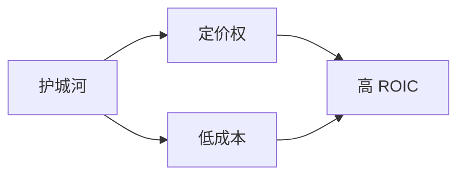

# 护城河

一句话定义：护城河（Moat）指企业抵御竞争者、长期维持高资本回报率的结构性优势。

## 背景

巴菲特用中世纪城堡外的护城河来比喻企业的竞争壁垒：城堡（企业）越值钱，就越需要又深又险的护城河来阻挡进攻者（竞争对手）。

> “最重要的是确定一家公司护城河的宽度。我们喜欢拥有又深又险护城河、里面还游着鳄鱼的经济城堡。” —— 沃伦·巴菲特

## 护城河的来源

- **品牌与定价权**：消费者愿意为信任付出溢价。
- **网络效应**：用户越多，产品越有价值。
- **成本优势**：规模或工艺带来的持续低成本。
- **转换成本**：客户更换供应商的代价很高。

## 与内在价值的关系

宽阔的护城河让未来现金流更可预测，从而保护了 [[内在价值]] 的复利增长。相关论述可参见 [[沃伦·巴菲特]] 历年致股东信。

## 结构示意

## See Also

- [[内在价值]]
- [[1986 致股东信]]

## Sources

- `corpus/raw/sample-notes.md`
