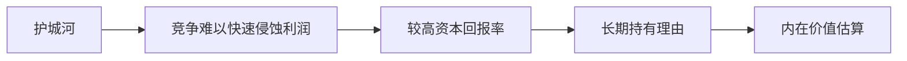

# 护城河

一句话定义：在本样例语料中，护城河指企业抵御竞争、并在较长时间内保持较高资本回报率的结构性优势。

## 摘要

`sample-notes.md` 与 `1986-letter.md` 都把护城河放在「优秀企业为什么值得长期持有」这一语料语境中：优秀企业不只是短期利润高，更重要的是竞争者不容易快速侵蚀利润。

语料明确提到的护城河来源包括：品牌、低成本结构、客户转换成本、网络效应、客户关系，以及其他结构性因素。样例语料没有提供机械评分公式，因此本页不扩写通用评估模型。

## 与其他页面的关系

- 护城河提高未来现金流的可预期性，因此会影响 [[内在价值]] 的估算。
- [[沃伦·巴菲特]] 在样例语料中是该概念的主要表达者。
- [[1986 致股东信原文]] 中保留了「护城河意味着可持续优势」的原文段落。

## 结构示意

## Open Questions

- 样例语料没有说明如何量化护城河宽度；真实项目中应回到原始资料查证，而不是补写模型常识。

